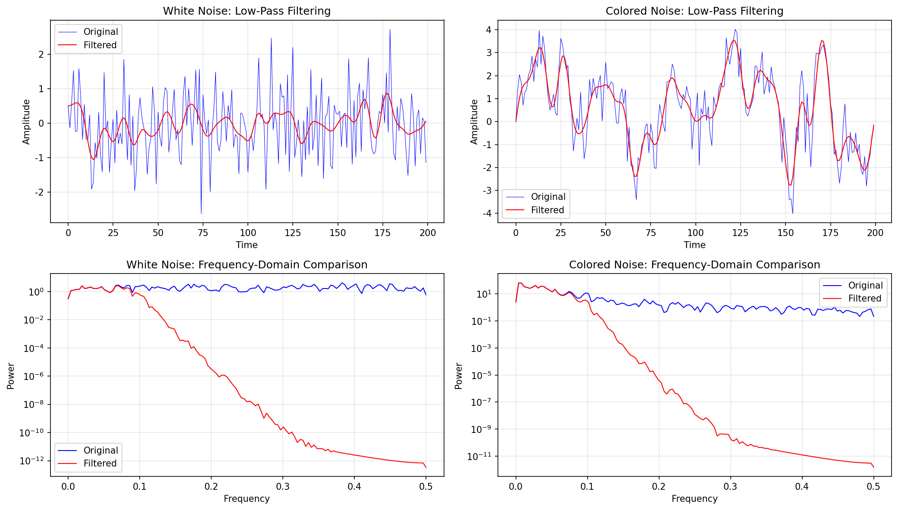

# 1.3 滤波器与卷积

**核心问题：** 什么是滤波器？卷积如何实现滤波？

---

## 什么是滤波器

**定义：** 滤波器是一个系统，它改变信号的频率成分。

**目的：**
- 去掉不想要的频率（噪音、干扰）
- 保留想要的频率（信息）

**例子：**
- 低通滤波器：保留低频，去掉高频（平滑信号）
- 高通滤波器：保留高频，去掉低频（突出边界）
- 带通滤波器：保留某个频率范围

---

## 滤波器的数学表示

### 频域表示

**滤波器的频率响应：**
$$H(f) = \frac{Y(f)}{X(f)}$$

其中：
- $X(f)$：输入信号的频谱
- $Y(f)$：输出信号的频谱
- $H(f)$：滤波器的频率响应

**滤波过程：**
$$Y(f) = H(f) \cdot X(f)$$

### 时域表示

**滤波器的冲激响应：**
$$h[n]$$

**滤波过程（卷积）：**
$$y[n] = \sum_{m} x[m] h[n-m] = x[n] * h[n]$$

---

## 卷积的直观理解

### 什么是卷积

**卷积是一种运算，它把两个信号混合在一起。**

$$y[n] = \sum_{m=-\infty}^{\infty} x[m] h[n-m]$$

### 卷积的步骤

1. **翻转**：把 $h[m]$ 翻转成 $h[-m]$
2. **平移**：平移 $n$ 个单位
3. **相乘**：$x[m]$ 和平移后的 $h[n-m]$ 相乘
4. **求和**：把所有乘积加起来

### 卷积的性质

**交换律：**
$$x * h = h * x$$

**结合律：**
$$(x * h_1) * h_2 = x * (h_1 * h_2)$$

**分配律：**
$$x * (h_1 + h_2) = x * h_1 + x * h_2$$

---

## 常见滤波器

### 1. 低通滤波器（Low-Pass Filter）

**目的：** 保留低频，去掉高频。

**冲激响应：**
$$h[n] = \frac{\sin(\omega_c n)}{\pi n}$$

其中 $\omega_c$ 是截止频率。

**应用：** 平滑信号，去掉高频噪音。

### 2. 高通滤波器（High-Pass Filter）

**目的：** 保留高频，去掉低频。

**冲激响应：**
$$h[n] = \delta[n] - \frac{\sin(\omega_c n)}{\pi n}$$

**应用：** 突出边界，检测快速变化。

### 3. 移动平均滤波器（Moving Average）

**最简单的低通滤波器：**
$$h[n] = \begin{cases} \frac{1}{M} & 0 \leq n < M \\ 0 & \text{otherwise} \end{cases}$$

**效果：** 平滑信号。

---

## 卷积定理

### 时域卷积 = 频域乘法

$$\mathcal{F}(x * h) = \mathcal{F}(x) \cdot \mathcal{F}(h)$$

### 为什么重要

**时域卷积很慢：** $O(N^2)$

**频域乘法很快：** $O(N \log N)$（用FFT）

### 快速卷积算法

1. 对 $x$ 和 $h$ 做FFT
2. 在频域相乘
3. 做逆FFT

**结果：** 速度快100倍以上！

---

## CNN中的卷积

### 从DSP到深度学习

**DSP中的卷积：**
- 滤波器 $h$ 是固定的（设计好的）
- 用来处理信号

**CNN中的卷积：**
- 卷积核是可学习的参数
- 网络自动学习最优的卷积核

### 启示

**CNN就是学习最优的滤波器。**

每个卷积层学习多个滤波器：
- 第一层：学习边界检测器
- 第二层：学习纹理检测器
- 第三层：学习形状检测器
- ...

---

## 卷积在信号检测中的应用

卷积不仅用于滤波，还是信号检测的核心工具。特别是**匹配滤波器**（Matched Filter）是卷积在检测中的直接应用。

**匹配滤波器的思想：** 用与待检测信号相匹配的滤波器进行卷积，输出最大时表示信号存在。

**关键性质：**
- 最大化信噪比（SNR）
- 达到Neyman-Pearson界（最优检测器）
- 本质上是卷积运算



**代码文件：** [`code/ch01_dsp/random_signals.py`](../../code/ch01_dsp/random_signals.py)  
**运行方式：** `python code/ch01_dsp/random_signals.py`

*图1.3：卷积对信号的作用示意。滤波器通过卷积抑制噪声、突出目标结构，这也是匹配滤波器能够提升检测性能的直观基础。*

详见 [1.6 信号检测 - 匹配滤波器](06_signal_detection.md#3-匹配滤波器matched-filter)

---

## 本节小结

滤波器通过卷积改变信号的频率成分：
- 时域：卷积运算
- 频域：乘法运算
- 卷积定理：连接时域和频域

CNN中的卷积核就是可学习的滤波器。

---

## 在LLM中的应用

### 卷积思想在LLM中的演进

1. **DSP中的卷积 → CNN中的卷积 → Transformer中的注意力**
   ```
   DSP滤波：h(t) * x(t) = ∫ h(τ)x(t-τ)dτ
   CNN卷积：可学习的滤波器
   Transformer注意力：软卷积，权重动态变化
   ```

2. **卷积的本质**
   - DSP中：用滤波器提取信号特征
   - CNN中：用卷积核提取图像特征
   - Transformer中：用注意力提取语义特征
   - 都是"特征提取"

### 滤波器设计在LLM中的应用

1. **低通滤波 → 全局语义提取**
   - DSP中的低通滤波：保留低频，去除高频
   - LLM中的全局注意力：关注全局信息，忽略局部噪声
   - 都是"信息平滑"

2. **高通滤波 → 局部细节提取**
   - DSP中的高通滤波：保留高频，去除低频
   - LLM中的局部注意力：关注局部细节，忽略全局背景
   - 都是"边界检测"

3. **带通滤波 → 多尺度特征提取**
   - DSP中的带通滤波：保留特定频率范围
   - LLM中的多头注意力：每个头关注不同的特征
   - 都是"多频率分析"

### 卷积定理在LLM中的应用

1. **时域卷积 = 频域乘法**
   - DSP中：用FFT加速卷积计算
   - LLM中：注意力机制可以看作是一种"软卷积"
   - 都是利用变换域的性质

2. **快速计算**
   - DSP中的FFT：O(N log N)
   - LLM中的注意力：O(N²)但可以优化
   - 都是追求计算效率

### 匹配滤波器在LLM中的应用

1. **匹配滤波器的思想**
   - DSP中：用与待检测信号相匹配的滤波器
   - LLM中：用与待预测Token相匹配的注意力权重
   - 都是"最优检测"

2. **信噪比最大化**
   - DSP中的匹配滤波器：最大化SNR
   - LLM中的注意力：最大化相关Token的权重
   - 都是"信号增强"

### 滤波器组在LLM中的应用

1. **多个滤波器 → 多头注意力**
   - DSP中的滤波器组：多个不同的滤波器
   - LLM中的多头注意力：多个不同的注意力头
   - 都是"多角度分析"

2. **特征融合**
   - DSP中：多个滤波器的输出融合
   - LLM中：多个注意力头的输出融合
   - 都是"信息整合"

### 自适应滤波在LLM中的应用

1. **自适应滤波器**
   - DSP中：根据信号特性动态调整
   - LLM中：注意力权重根据输入动态变化
   - 都是"动态适应"

2. **学习滤波器**
   - DSP中的自适应滤波：学习最优的滤波系数
   - LLM中的注意力：学习最优的注意力权重
   - 都是"参数学习"

---

**下一节：** [1.4 时频分析](04_time_freq.md)
