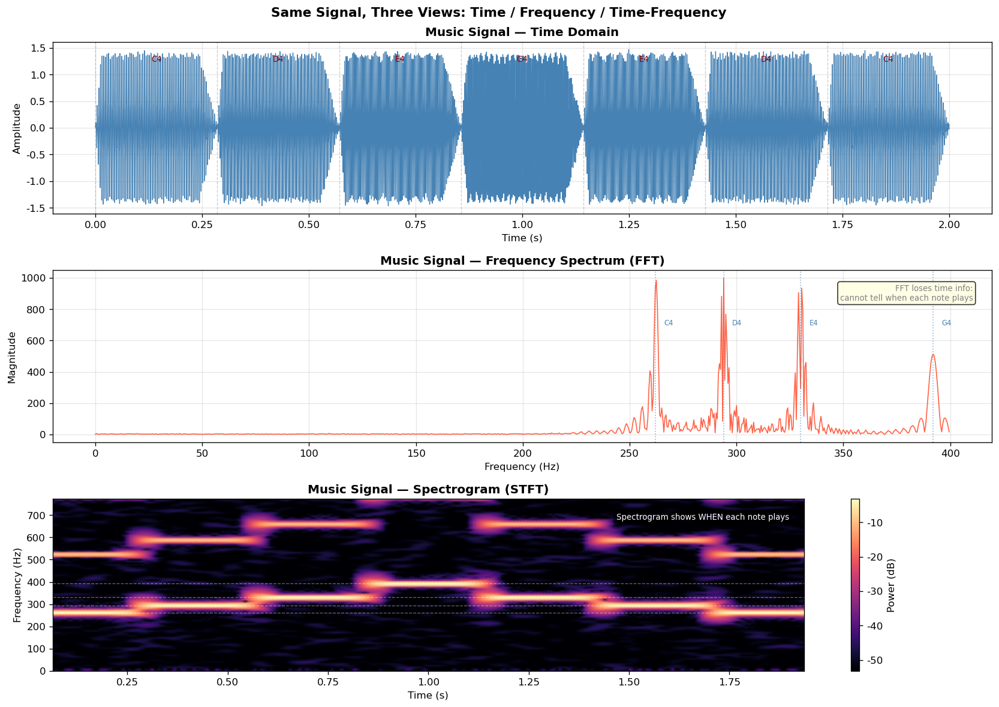
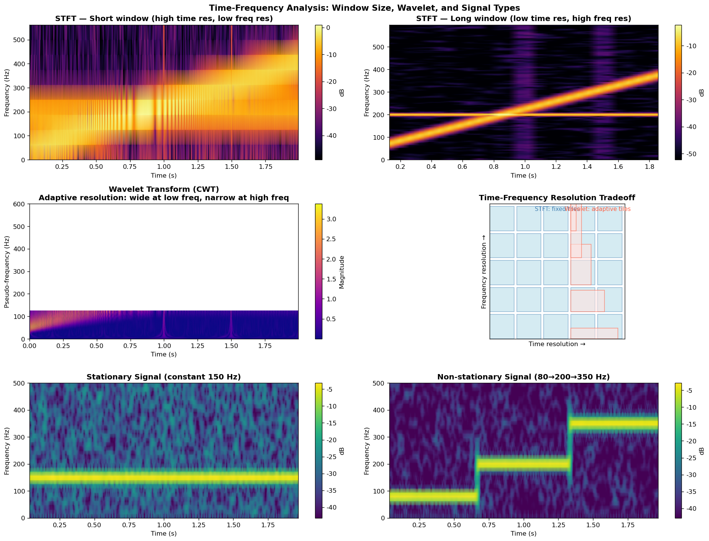

# 1.4 时频分析

**核心问题：** 如何同时看到信号的时间和频率信息？

---

## 问题：时域和频域的权衡

### 傅里叶变换的局限

傅里叶变换告诉我们信号包含哪些频率，但**不告诉我们这些频率什么时候出现**。

**例子：**
```
信号1：10 Hz正弦波（全程）
信号2：前5秒是10 Hz，后5秒是20 Hz

频域看起来不同，但如果只看频谱，
我们看不出频率是什么时候变化的。
```

### 不确定性原理

**时间分辨率和频率分辨率不能同时很高。**

- 窗口很小 → 时间分辨率高，频率分辨率低
- 窗口很大 → 频率分辨率高，时间分辨率低

这是信号处理的基本限制，不是算法问题。

---

## 短时傅里叶变换（STFT）

### 思想

把信号分成小段，对每段做傅里叶变换。

### 数学表达

$$X(t, f) = \int x(\tau) w(t - \tau) e^{-j2\pi f\tau} d\tau$$

其中：
- $x(\tau)$：原始信号
- $w(t)$：窗函数（决定每段的长度）
- $t$：时间
- $f$：频率

### 步骤

1. 选择窗函数（如Hann窗）
2. 把信号分成重叠的小段
3. 对每段做FFT
4. 把结果排列成时频图

### 窗函数的选择

**常见窗函数：**
- **Hann窗**：平衡的时频分辨率
- **Hamming窗**：类似Hann，但边界不为0
- **Blackman窗**：更好的频率分辨率，但时间分辨率差

---

## 时频图（Spectrogram）

### 什么是时频图

一个二维图像，显示信号在不同时刻的频率成分。

- **横轴**：时间
- **纵轴**：频率
- **颜色深度**：幅度大小

### 例子

下图展示了同一段音乐信号的三种视角：时域波形、频谱（FFT）和时频图（语谱图）。



*图1.4a：同一段音乐信号的三种视角。上：时域波形，可以看到音符的幅度包络；中：频谱（FFT），可以看到各音符的基频和谐波，但无法区分哪个音符在哪个时刻出现；下：语谱图（STFT），同时展示了时间和频率信息，可以清晰看到每个音符的出现时刻和频率成分。*

**代码文件：** [`code/ch01_dsp/time_freq_analysis.py`](../../code/ch01_dsp/time_freq_analysis.py)  
**运行方式：** `python code/ch01_dsp/time_freq_analysis.py`

### 优点

- 既保留时间信息，又保留频率信息
- 直观看出频率如何随时间变化
- 适合分析非平稳信号

---

## 小波变换（Wavelet Transform）

### 问题

STFT的窗大小固定，不适合分析多尺度信号。

**例子：**
- 低频成分变化慢，需要大窗口
- 高频成分变化快，需要小窗口

### 解决方案

小波变换用不同大小的窗分析不同频率。

### 数学表达

$$W(a, b) = \int x(t) \psi^*\left(\frac{t-b}{a}\right) dt$$

其中：
- $a$：尺度（对应频率）
- $b$：位置（对应时间）
- $\psi(t)$：母小波

### 优点

- 自适应的时频分辨率
- 多尺度分析
- 适合分析突变和奇异点

---

## 实际应用

### 音乐分析

- **识别乐器**：不同乐器的频率特征不同
- **节拍检测**：看时频图中的能量峰值
- **音高估计**：找主频率成分

### 医学诊断

- **脑电图（EEG）**：看脑波的频率变化
- **心电图（ECG）**：检测异常心律
- **肌电图（EMG）**：分析肌肉活动

### 地震学

- **地震波分析**：不同类型地震波的频率不同
- **震源定位**：用时频信息确定震源

### 语音处理

- **语音识别**：提取语音的时频特征
- **说话人识别**：不同人的频率特征不同
- **语音增强**：去掉噪音的频率成分

---

## 本节小结

时频分析解决了傅里叶变换的局限：
- **STFT**：简单有效，固定时频分辨率
- **小波变换**：自适应分辨率，适合多尺度分析
- **时频图**：直观展示信号的时频特性

下图进一步对比了不同窗口大小的 STFT、小波变换，以及平稳信号与非平稳信号的时频图差异：



*图1.4b：时频分析方法对比。上行：短窗 STFT（时间分辨率高）vs 长窗 STFT（频率分辨率高），体现不确定性原理；中行左：小波变换（CWT），低频用宽窗、高频用窄窗，自适应分辨率；中行右：时频分辨率权衡示意图，STFT 使用固定大小的时频格，小波使用自适应大小的时频格；下行：平稳信号（固定频率）vs 非平稳信号（频率随时间变化）的语谱图对比。*

---

## 在LLM中的应用

### 时频分析思想在LLM中的应用

1. **Token位置 ≈ 时间，语义特征 ≈ 频率**
   - DSP中的时频分析：不同时刻的频率成分
   - LLM中的注意力：不同位置的语义关系
   - 都是"位置-特征"的二维分析

2. **STFT → 局部注意力**
   - DSP中的STFT：用窗函数分割信号
   - LLM中的局部注意力：限制注意力范围
   - 都是"局部分析"

### 小波变换在LLM中的应用

1. **多尺度分析**
   - DSP中的小波变换：多个尺度的分析
   - LLM中的多层Transformer：多层次的特征提取
   - 都是"从粗到细"的分析

2. **自适应分辨率**
   - DSP中的小波：低频用长窗，高频用短窗
   - LLM中的多头注意力：不同头关注不同范围
   - 都是"自适应"

### 时频图在LLM中的类比

1. **时频图 ≈ 注意力热力图**
   - DSP中的时频图：显示不同时刻的频率成分
   - LLM中的注意力热力图：显示不同位置的注意力权重
   - 都是"二维可视化"

2. **可解释性**
   - DSP中的时频图：直观看出信号的特性
   - LLM中的注意力热力图：直观看出模型的决策
   - 都是"可视化分析"

### 短时傅里叶变换（STFT）在LLM中的应用

1. **窗函数 → 注意力掩码**
   - DSP中的窗函数：决定分析的范围
   - LLM中的注意力掩码：决定能看到的范围
   - 都是"范围限制"

2. **固定窗口 → 固定上下文**
   - DSP中的STFT：固定窗口大小
   - LLM中的上下文窗口：固定大小（如4K、8K tokens）
   - 都是"固定范围"

### 多尺度分析在LLM中的应用

1. **粗粒度分析 → 全局语义**
   - DSP中的低频小波：捕捉信号的整体趋势
   - LLM中的全局注意力：捕捉文本的主题
   - 都是"宏观"分析

2. **细粒度分析 → 局部细节**
   - DSP中的高频小波：捕捉信号的细节
   - LLM中的局部注意力：捕捉词汇和语法
   - 都是"微观"分析

### 时频分辨率权衡在LLM中的应用

1. **不确定性原理**
   - DSP中：时间分辨率和频率分辨率不能同时很高
   - LLM中：上下文长度和计算效率不能同时很高
   - 都是"权衡"

2. **长上下文LLM**
   - 类似于DSP中的小波变换
   - 用多尺度方法处理长序列
   - 如Longformer、BigBird等

---

**下一节：** [1.5 随机信号理论](05_random_signals.md)
