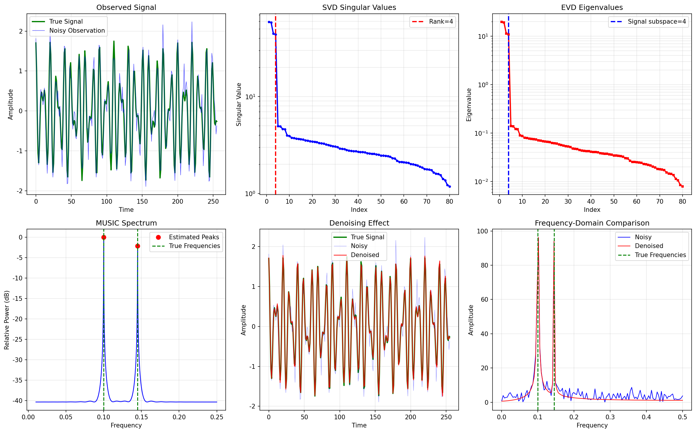
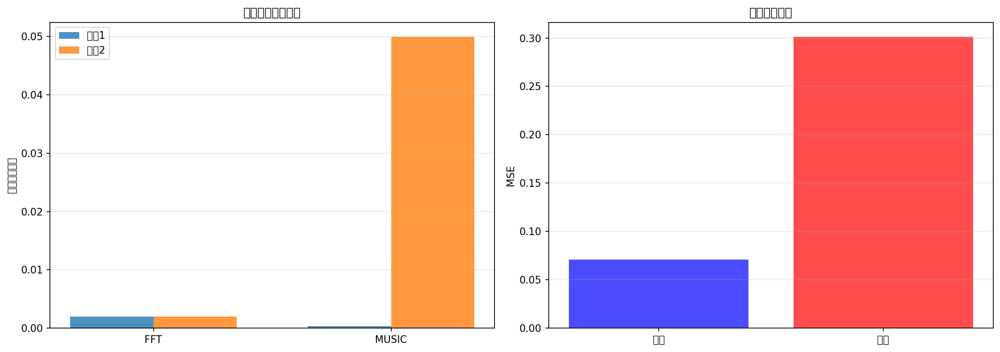

# 1.8 矩阵分解应用

**核心问题：** 如何用矩阵分解方法解决信号处理问题？

---

## 矩阵分解基础

### 奇异值分解（Singular Value Decomposition, SVD）

**定义：** 任何矩阵都可以分解为三个矩阵的乘积。

$$\mathbf{A} = \mathbf{U} \boldsymbol{\Sigma} \mathbf{V}^H$$

其中：
- $\mathbf{U}$：$m \times m$ 酉矩阵（左奇异向量）
- $\boldsymbol{\Sigma}$：$m \times n$ 对角矩阵（奇异值）
- $\mathbf{V}^H$：$n \times n$ 酉矩阵的共轭转置（右奇异向量）

**奇异值：** $\sigma_1 \geq \sigma_2 \geq \cdots \geq \sigma_r > 0$

**秩：** $\text{rank}(\mathbf{A}) = r$（非零奇异值的个数）

### 特征值分解（Eigenvalue Decomposition, EVD）

**定义：** 对于方阵 $\mathbf{A}$，存在特征向量和特征值。

$$\mathbf{A} = \mathbf{Q} \boldsymbol{\Lambda} \mathbf{Q}^{-1}$$

其中：
- $\mathbf{Q}$：特征向量矩阵
- $\boldsymbol{\Lambda}$：特征值对角矩阵

**对于Hermitian矩阵：** $\mathbf{A} = \mathbf{A}^H$

$$\mathbf{A} = \mathbf{Q} \boldsymbol{\Lambda} \mathbf{Q}^H$$

其中 $\mathbf{Q}$ 是酉矩阵。

### QR分解

**定义：** 矩阵分解为正交矩阵和上三角矩阵的乘积。

$$\mathbf{A} = \mathbf{Q} \mathbf{R}$$

其中：
- $\mathbf{Q}$：$m \times n$ 正交矩阵
- $\mathbf{R}$：$n \times n$ 上三角矩阵

**应用：** 数值稳定的最小二乘求解。

---

## 信号处理中的矩阵表示

### 数据矩阵

**问题：** 如何用矩阵表示信号？

**方法1：向量表示**
$$\mathbf{x} = [x[0], x[1], \ldots, x[N-1]]^T$$

**方法2：Hankel矩阵**
$$\mathbf{H} = \begin{bmatrix}
x[0] & x[1] & \cdots & x[M-1] \\
x[1] & x[2] & \cdots & x[M] \\
\vdots & \vdots & \ddots & \vdots \\
x[N-M] & x[N-M+1] & \cdots & x[N-1]
\end{bmatrix}$$

**用途：** 将一维信号转换为二维矩阵，便于矩阵分解。

### 协方差矩阵

**定义：** 信号的二阶统计特性。

$$\mathbf{R} = E[\mathbf{x} \mathbf{x}^H]$$

**样本协方差矩阵：**
$$\hat{\mathbf{R}} = \frac{1}{N} \sum_{n=0}^{N-1} \mathbf{x}[n] \mathbf{x}^H[n]$$

**性质：**
- Hermitian矩阵：$\mathbf{R} = \mathbf{R}^H$
- 半正定：所有特征值 $\geq 0$
- 特征值反映信号的功率分布

---

## 子空间方法

### 信号子空间和噪声子空间

**问题：** 给定观测 $\mathbf{y} = \mathbf{s} + \mathbf{w}$，如何分离信号和噪声？

**方法：** 对协方差矩阵进行EVD。

$$\mathbf{R} = \mathbf{Q}_s \boldsymbol{\Lambda}_s \mathbf{Q}_s^H + \mathbf{Q}_w \boldsymbol{\Lambda}_w \mathbf{Q}_w^H$$

其中：
- $\mathbf{Q}_s$：信号子空间（对应大特征值）
- $\mathbf{Q}_w$：噪声子空间（对应小特征值）

**关键性质：** 信号子空间和噪声子空间正交。

$$\mathbf{Q}_s^H \mathbf{Q}_w = 0$$

### MUSIC算法（Multiple Signal Classification）

**问题：** 估计多个信号的频率。

**观测模型：**
$$y[n] = \sum_{k=1}^{K} A_k e^{j2\pi f_k n} + w[n]$$

**MUSIC算法步骤：**

1. **构造数据矩阵**
   $$\mathbf{X} = [x[0], x[1], \ldots, x[N-M]]$$
   其中 $x[n] = [y[n], y[n+1], \ldots, y[n+M-1]]^T$

2. **计算协方差矩阵**
   $$\mathbf{R} = \frac{1}{N-M+1} \mathbf{X} \mathbf{X}^H$$

3. **EVD分解**
   $$\mathbf{R} = \mathbf{Q}_s \boldsymbol{\Lambda}_s \mathbf{Q}_s^H + \mathbf{Q}_w \boldsymbol{\Lambda}_w \mathbf{Q}_w^H$$

4. **MUSIC谱**
   $$P_{\text{MUSIC}}(f) = \frac{1}{\|\mathbf{Q}_w^H \mathbf{a}(f)\|^2}$$
   其中 $\mathbf{a}(f) = [1, e^{j2\pi f}, \ldots, e^{j2\pi f(M-1)}]^T$ 是导向向量

5. **峰值检测**
   找到 $P_{\text{MUSIC}}(f)$ 的 $K$ 个最大峰值

**优点：**
- 高分辨率：能分离接近的频率
- 性能接近CRB

*图1.9：矩阵分解在信号子空间分析中的示意。通过分解协方差矩阵，可以把主要信号结构与噪声成分区分开。*

**缺点：**
- 需要知道信号个数 $K$
- 计算复杂度较高

### ESPRIT算法（Estimation of Signal Parameters via Rotational Invariance Techniques）

**思想：** 利用信号的旋转不变性。

**优点：**
- 不需要知道导向向量
- 计算复杂度低
- 性能好

**应用：** 频率估计、到达角估计

---

## 主成分分析（Principal Component Analysis, PCA）

### 原理

**问题：** 如何从高维数据中提取主要特征？

**方法：** 找到方差最大的方向。

**步骤：**

1. **中心化数据**
   $$\mathbf{X}_c = \mathbf{X} - \bar{\mathbf{X}}$$

2. **计算协方差矩阵**
   $$\mathbf{C} = \frac{1}{N} \mathbf{X}_c^T \mathbf{X}_c$$

3. **EVD分解**
   $$\mathbf{C} = \mathbf{Q} \boldsymbol{\Lambda} \mathbf{Q}^T$$

4. **选择主成分**
   选择特征值最大的 $K$ 个特征向量

5. **降维**
   $$\mathbf{Y} = \mathbf{X}_c \mathbf{Q}[:, 1:K]$$

### 在信号处理中的应用

**1. 信号去噪**

**思想：** 信号集中在少数几个主成分，噪声分散在所有主成分。

**方法：**
- 对信号进行PCA
- 保留主要的主成分
- 丢弃小的主成分（主要是噪声）
- 重构信号

**2. 特征提取**

**应用：** 从复杂信号中提取关键特征。

**例子：**
- 语音识别：从语谱图提取主要特征
- 人脸识别：从人脸图像提取特征脸（eigenfaces）
- 心电图分析：提取心跳的主要特征

**3. 数据压缩**

**思想：** 用少数主成分表示原始数据。

**压缩率：**
$$\text{压缩率} = \frac{K}{D} \times 100\%$$

其中 $K$ 是保留的主成分数，$D$ 是原始维数。

---

## 低秩近似和去噪

### 低秩近似

**问题：** 用低秩矩阵近似原始矩阵。

**方法：** 使用SVD的截断版本。

$$\mathbf{A}_r = \sum_{i=1}^{r} \sigma_i \mathbf{u}_i \mathbf{v}_i^H$$

其中 $r < \text{rank}(\mathbf{A})$。

**性质：**
- 最小化Frobenius范数误差
- 保留最重要的信息

### 信号去噪

**观测模型：**
$$\mathbf{Y} = \mathbf{S} + \mathbf{W}$$

其中 $\mathbf{S}$ 是低秩信号，$\mathbf{W}$ 是噪声。

**去噪方法：**

1. **SVD分解**
   $$\mathbf{Y} = \mathbf{U} \boldsymbol{\Sigma} \mathbf{V}^H$$

2. **阈值处理**
   $$\hat{\sigma}_i = \begin{cases} \sigma_i & \text{if } \sigma_i > \tau \\ 0 & \text{otherwise} \end{cases}$$

3. **重构**
   $$\hat{\mathbf{S}} = \mathbf{U} \hat{\boldsymbol{\Sigma}} \mathbf{V}^H$$

**优点：**
- 简单有效
- 保留信号结构

---

## 实际应用

### 1. 频率估计

**应用MUSIC算法：**
- 高分辨率频率估计
- 多信号分离
- 性能接近CRB

*图1.10：矩阵分解方法的性能对比示意。子空间方法通常在分辨率和抗噪声能力上优于简单谱估计。*

**例子：** 功率系统中的谐波检测

### 2. 到达角估计（Direction of Arrival, DOA）

**问题：** 用阵列天线估计信号的到达方向。

**方法：**
- MUSIC：高分辨率
- ESPRIT：低复杂度
- 子空间方法

**应用：** 雷达、声纳、无线通信

### 3. 信号去噪

**应用PCA或SVD：**
- 去除背景噪声
- 保留信号特征
- 改进信噪比

**例子：**
- 医学图像去噪
- 地震数据处理
- 语音增强

### 4. 数据压缩

**应用PCA：**
- 降低存储空间
- 加快处理速度
- 保留关键信息

**例子：**
- 图像压缩
- 视频压缩
- 传感器数据压缩

### 5. 故障诊断

**应用子空间方法：**
- 检测异常
- 识别故障类型
- 预测故障

**例子：**
- 轴承故障诊断
- 电机故障检测
- 结构健康监测

---

## 本节小结

矩阵分解是信号处理的强大工具：

- **基本分解**：SVD、EVD、QR分解
- **子空间方法**：MUSIC、ESPRIT
- **特征提取**：PCA
- **去噪和压缩**：低秩近似
- **实际应用**：频率估计、DOA估计、去噪、压缩、故障诊断

这些方法在现代信号处理和机器学习中广泛应用。

---

## 在LLM中的应用

### 矩阵分解思想在LLM中的应用

1. **SVD ≈ 特征学习**
   - DSP中的SVD：分解矩阵为秩-1矩阵的和
   - LLM中的特征学习：学习低秩的语义表示
   - 都是"维度降低"

2. **低秩近似**
   - DSP中的低秩近似：用少数几个分量表示信号
   - LLM中的嵌入表示：用低维向量表示Token
   - 都是"压缩表示"

### PCA在LLM中的应用

1. **主成分分析**
   - DSP中的PCA：找到数据的主要方向
   - LLM中的特征提取：找到语义的主要方向
   - 都是"方向分析"

2. **维度降低**
   - DSP中的PCA：从高维降到低维
   - LLM中的嵌入：从离散Token到连续向量
   - 都是"维度变换"

### 特征值分解在LLM中的应用

1. **特征值和特征向量**
   - DSP中的EVD：分解协方差矩阵
   - LLM中的注意力：分解Token之间的关系
   - 都是"关系分析"

2. **主要特征**
   - DSP中的大特征值：主要的信号成分
   - LLM中的大注意力权重：主要的语义关系
   - 都是"重要性排序"

### 子空间方法在LLM中的应用

1. **信号子空间 ≈ 语义子空间**
   - DSP中的信号子空间：信号所在的低维空间
   - LLM中的语义子空间：语义所在的低维空间
   - 都是"子空间"

2. **MUSIC算法**
   - DSP中的MUSIC：利用子空间进行高分辨率估计
   - LLM中的多头注意力：利用多个子空间进行分析
   - 都是"多子空间"

### QR分解在LLM中的应用

1. **正交化**
   - DSP中的QR分解：将矩阵分解为正交矩阵和上三角矩阵
   - LLM中的正交化：确保不同特征的独立性
   - 都是"正交性"

2. **数值稳定性**
   - DSP中的QR分解：提高数值稳定性
   - LLM中的层归一化：提高训练稳定性
   - 都是"稳定性"

### 秩的概念在LLM中的应用

1. **矩阵秩**
   - DSP中的秩：矩阵的本质维度
   - LLM中的表达能力：模型能表达的复杂度
   - 都是"复杂度"

2. **低秩结构**
   - DSP中的低秩信号：信号的本质维度低
   - LLM中的低秩参数：参数的本质维度低
   - 都是"压缩性"

### 去噪和压缩在LLM中的应用

1. **低秩近似去噪**
   - DSP中的低秩近似：去除噪声
   - LLM中的注意力：关注重要信息，忽略噪声
   - 都是"信号增强"

2. **参数压缩**
   - DSP中的低秩近似：压缩数据
   - LLM中的量化和剪枝：压缩模型
   - 都是"压缩"

### 频率估计中的矩阵方法在LLM中的应用

1. **MUSIC和ESPRIT**
   - DSP中的MUSIC/ESPRIT：高分辨率频率估计
   - LLM中的多头注意力：高分辨率特征提取
   - 都是"高分辨率"

2. **子空间旋转**
   - DSP中的ESPRIT：利用子空间旋转
   - LLM中的位置编码：利用旋转编码位置
   - 都是"旋转"

### 特征提取在LLM中的应用

1. **主要特征**
   - DSP中的PCA：提取主要特征
   - LLM中的多层Transformer：逐层提取特征
   - 都是"特征提取"

2. **特征的层次性**
   - DSP中的多尺度分析：不同尺度的特征
   - LLM中的多层网络：不同层次的特征
   - 都是"层次性"

### 矩阵分解在LLM推理中的应用

1. **快速推理**
   - DSP中的低秩近似：加速计算
   - LLM中的参数压缩：加速推理
   - 都是"计算加速"

2. **模型压缩**
   - DSP中的低秩分解：压缩数据
   - LLM中的知识蒸馏：压缩模型
   - 都是"压缩"

---

**下一章：** [第2章：优化与机器学习](../02_optimization/README.md)
