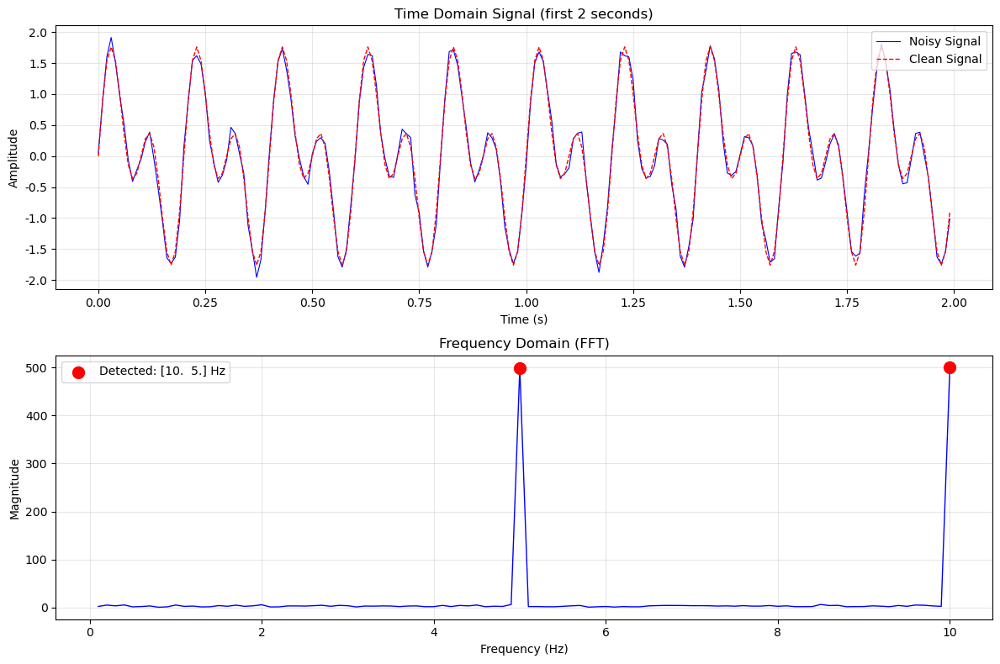

# 第1章：传统数字信号处理

**版本：** v2.0  
**最后更新：** 2026-05-14

## 章节概览

本章介绍传统数字信号处理（DSP）的核心概念，为后续深度学习章节奠定基础。虽然DSP是经典领域，但其思想在现代AI中仍然随处可见：CNN中的卷积来自DSP的滤波，Transformer中的位置编码来自傅里叶变换。

## 小节目录

### 基础概念（1.1-1.4）
- **1.1 信号的三种视角** — 时域、频域、时频，理解信号的多个角度
- **1.2 傅里叶变换与频谱分析** — 从时域到频域的转换
- **1.3 滤波器与卷积** — 信号处理的基本操作，CNN的原型
- **1.4 时频分析** — 同时看到时间和频率信息

### 理论与应用（1.5-1.8）
- **1.5 随机信号理论** — 统计特性、平稳性、高斯过程、噪声模型
- **1.6 信号检测** — 假设检验、似然比检验、ROC曲线、检测器设计
- **1.7 信号估计** — 参数估计、MLE、LSE、贝叶斯估计、Cramér-Rao界
- **1.8 矩阵分解应用** — SVD、EVD、子空间方法、MUSIC、PCA、去噪

## 学习时间

- **快速版**（仅阅读1.1-1.4）：15分钟
- **标准版**（阅读1.1-1.8）：60分钟
- **深度版**（包含代码实验和练习）：120分钟

## 核心问题

完成本章后，你应该能回答：

**基础部分（1.1-1.4）：**
1. 信号可以从哪些角度理解？
2. 傅里叶变换的本质是什么？
3. 卷积如何实现滤波？
4. CNN中的卷积核与DSP中的滤波器有什么关系？

**进阶部分（1.5-1.8）：**
5. 什么是随机信号？如何分析其统计特性？
6. 如何在噪声中检测信号？什么是ROC曲线？
7. 如何从观测中估计信号参数？什么是Cramér-Rao界？
8. 矩阵分解如何应用于信号处理？什么是MUSIC算法？

## 代码实验

本章包含两个核心实验，帮助理解DSP的基本概念：

### 实验1：FFT频谱分析
- **文件：** [`code/ch01_dsp/fft_spectrum.py`](../../code/ch01_dsp/fft_spectrum.py)
- **内容：** 用FFT分析信号的频谱特性
- **运行：** `python code/ch01_dsp/fft_spectrum.py`
- **输出：** 频谱图、功率谱密度、频率成分分析



*图1.1：FFT频谱分析。展示信号在频域的表示，不同频率分量的幅度和相位。*

## 推荐学习路径

### 路径1：快速入门（15分钟）
- 阅读 1.1-1.4 的正文
- 查看图表和公式
- 理解基础概念
- 回答"核心问题"中的前4个问题

### 路径2：标准学习（60分钟）
- 阅读 1.1-1.8 的所有内容
- 理解每个小节的核心概念
- 查看实际应用例子
- 回答"核心问题"中的所有8个问题

### 路径3：深度学习（120分钟）
- 阅读所有内容
- 运行代码实验
- 分析实验结果
- 自己实现简单的算法（如能量检测器、MUSIC算法）
- 完成练习题

## 关键概念速查

| 概念 | 公式 | 直观理解 | 章节 |
|------|------|---------|------|
| 傅里叶变换 | $X(f) = \int_{-\infty}^{\infty} x(t)e^{-j2\pi ft}dt$ | 信号从时域到频域的转换 | 1.2 |
| 卷积 | $y[n] = \sum_{m} x[m]h[n-m]$ | 信号与滤波器的组合 | 1.3 |
| 频率响应 | $H(f) = \|H(f)\|e^{j\angle H(f)}$ | 滤波器对不同频率的响应 | 1.3 |
| 自相关函数 | $R(\tau) = E[x(t)x(t+\tau)]$ | 信号与自身的相似性 | 1.5 |
| 功率谱密度 | $S(f) = \mathcal{F}\{R(\tau)\}$ | 信号功率在频域的分布 | 1.5 |
| 似然比检验 | $\Lambda(y) = \frac{p(y\|H_1)}{p(y\|H_0)}$ | 最优信号检测 | 1.6 |
| 检测概率 | $P_d = P(\text{判定}H_1\|H_1\text{真实})$ | 正确检测信号的概率 | 1.6 |
| 最大似然估计 | $\hat{\theta}_{ML} = \arg\max_{\theta} L(\theta;\mathbf{y})$ | 最可能的参数值 | 1.7 |
| Cramér-Rao界 | $\text{Var}(\hat{\theta}) \geq \frac{1}{I(\theta)}$ | 估计器方差的下界 | 1.7 |
| 奇异值分解 | $\mathbf{A} = \mathbf{U}\boldsymbol{\Sigma}\mathbf{V}^H$ | 矩阵的标准分解 | 1.8 |

## 常见问题

**Q: 为什么需要傅里叶变换？**
A: 很多信号处理问题在频域更容易解决。例如，滤波在频域就是简单的乘法。

**Q: FFT和DFT有什么区别？**
A: FFT是DFT的快速算法，计算复杂度从O(n²)降低到O(n log n)。

**Q: 卷积为什么在CNN中这么重要？**
A: 卷积能提取局部特征，这正是图像处理所需要的。

**Q: 什么是随机信号？为什么要研究它？**
A: 随机信号是不能完全确定的信号（如噪声）。现实中的信号往往包含随机成分，需要用统计方法分析。

**Q: 如何判断信号是否存在？**
A: 使用假设检验和似然比检验。通过设置阈值，在虚警率和漏检率之间权衡。

**Q: 参数估计和信号检测有什么区别？**
A: 检测是判断信号是否存在（二元决策），估计是确定信号的具体参数值（连续值）。

**Q: MUSIC算法为什么能高分辨率估计频率？**
A: MUSIC利用信号子空间和噪声子空间的正交性，能分离接近的频率成分。

## 扩展内容

### 本章涵盖的主题
- 基础DSP概念（1.1-1.4）
- 随机信号处理（1.5）
- 信号检测理论（1.6）
- 参数估计理论（1.7）
- 矩阵方法应用（1.8）

### 与后续章节的连接
- **第2章（优化与机器学习）**：参数估计的优化方法
- **第3章（深度学习）**：卷积神经网络中的卷积操作
- **第4章（Transformer）**：位置编码与傅里叶变换的关系
- **第5-8章（LLM）**：信号处理思想在序列处理中的应用

## 关键连接点

### DSP → CNN

```
DSP中的卷积：y[n] = Σ x[m] * h[n-m]
                    ↓
CNN中的卷积核：可学习的滤波器
```

**启示：** CNN就是学习最优的滤波器。

### 傅里叶变换 → 位置编码

```
傅里叶变换：用不同频率的正弦波表示信号
                    ↓
位置编码：用不同频率的正弦波表示位置
```

**启示：** 位置编码让Transformer能理解序列顺序。

---

**下一步：** 阅读 [1.1 信号的三种视角](01_signals.md)
