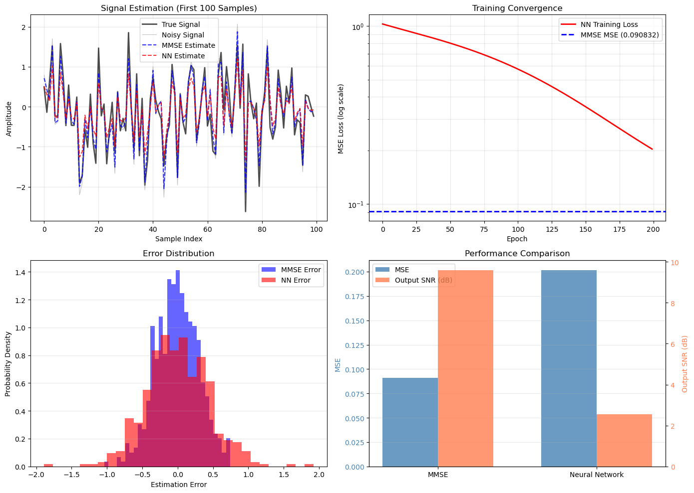

# 2.1 梯度下降基础

**核心问题：** 什么是梯度下降？为什么它这么重要？

---

## 优化问题

### 问题设定

给定一个损失函数 $L(\mathbf{w})$，找到使损失最小的参数 $\mathbf{w}$。

$$\mathbf{w}^* = \arg\min_{\mathbf{w}} L(\mathbf{w})$$

### 为什么重要

- **机器学习**：训练模型就是最小化损失函数
- **深度学习**：神经网络有数百万个参数，需要高效的优化算法
- **LLM**：训练一个LLM就是优化数十亿个参数

---

## 梯度下降的直观理解

### 类比：下山

想象你在山上，想找到最低点。

1. **看周围**：计算梯度（最陡的下坡方向）
2. **往下走**：沿着梯度方向走一步
3. **重复**：直到到达山底

### 数学表达

$$\mathbf{w}_{t+1} = \mathbf{w}_t - \alpha \nabla L(\mathbf{w}_t)$$

其中：
- $\mathbf{w}_t$：第t步的参数
- $\alpha$：学习率（步长）
- $\nabla L(\mathbf{w}_t)$：损失函数在 $\mathbf{w}_t$ 处的梯度

---

## 偏导数与梯度基础

### 什么是偏导数

对于多元函数 $f(x_1, x_2, ..., x_n)$，**偏导数**是指对其中一个变量求导，其他变量视为常数。

**例子：** 对于函数 $f(x, y) = x^2 + 2xy + y^2$

- 对 $x$ 的偏导数：$\frac{\partial f}{\partial x} = 2x + 2y$
- 对 $y$ 的偏导数：$\frac{\partial f}{\partial y} = 2x + 2y$

**与普通导数的区别：**
- 普通导数：对一元函数求导
- 偏导数：对多元函数中的一个变量求导

### 梯度的几何意义

**梯度向量**定义为所有偏导数组成的向量：

$$\nabla f = \begin{bmatrix} \frac{\partial f}{\partial x_1} \\ \frac{\partial f}{\partial x_2} \\ \vdots \\ \frac{\partial f}{\partial x_n} \end{bmatrix}$$

**关键性质：** 梯度向量指向函数增长最快的方向。

**为什么梯度下降有效：**
1. 梯度 $\nabla L$ 指向损失函数增长最快的方向
2. 梯度的反方向 $-\nabla L$ 指向下降最快的方向
3. 沿着梯度反方向移动，能最快地减小损失函数值
4. 这就是梯度下降的核心原理

**数学表达：**
$$\mathbf{w}_{t+1} = \mathbf{w}_t - \alpha \nabla L(\mathbf{w}_t)$$

其中：
- $\alpha$ 是学习率（步长）
- $-\nabla L(\mathbf{w}_t)$ 是下降最快的方向

---

## 梯度的计算

### 什么是梯度

梯度是函数在某点的方向导数，指向函数增长最快的方向。

$$\nabla L = \begin{bmatrix} \frac{\partial L}{\partial w_1} \\ \frac{\partial L}{\partial w_2} \\ \vdots \\ \frac{\partial L}{\partial w_n} \end{bmatrix}$$

### 链式法则

对于复合函数，用链式法则计算梯度：

$$\frac{\partial L}{\partial w} = \frac{\partial L}{\partial y} \frac{\partial y}{\partial w}$$

### 反向传播（Backpropagation）

在神经网络中，用反向传播高效计算梯度。

**思想：** 从输出层开始，逐层计算梯度，复用中间结果。

**复杂度：** $O(n)$（n是参数数量），而不是 $O(n^2)$。

---

## 学习率的影响

### 学习率太小

```
收敛很慢，需要很多步才能到达最优点。
```

### 学习率太大

```
可能跳过最优点，甚至发散。
```

### 学习率合适

```
快速收敛到最优点。
```

---

## 梯度下降的变种

### 批量梯度下降（Batch GD）

用所有数据计算梯度：

$$\mathbf{w}_{t+1} = \mathbf{w}_t - \alpha \sum_{i=1}^{N} \nabla L_i(\mathbf{w}_t)$$

**优点：** 梯度准确，收敛稳定

**缺点：** 计算慢，内存占用大

### 随机梯度下降（SGD）

用一个样本计算梯度：

$$\mathbf{w}_{t+1} = \mathbf{w}_t - \alpha \nabla L_i(\mathbf{w}_t)$$

**优点：** 计算快，内存占用小

**缺点：** 梯度有噪音，收敛不稳定

### 小批量梯度下降（Mini-batch GD）

用一小批数据计算梯度：

$$\mathbf{w}_{t+1} = \mathbf{w}_t - \alpha \sum_{i \in \text{batch}} \nabla L_i(\mathbf{w}_t)$$

**优点：** 平衡速度和稳定性

**缺点：** 需要调整批大小

---

## 本节小结

梯度下降是机器学习的基础：
- 沿着梯度方向下降
- 学习率控制步长
- 反向传播高效计算梯度

---



*图2.1：MMSE估计器与神经网络估计器的性能对比。它直观展示了优化目标相同时，不同模型结构在误差和信噪比上的表现差异，也帮助理解为什么后续需要更强的优化器与更灵活的模型。*

## 代码实验

完整的代码示例位于：[`code/ch02_optimization/mmse_vs_nn.py`](../../code/ch02_optimization/mmse_vs_nn.py)

**运行方式：**
```bash
python code/ch02_optimization/mmse_vs_nn.py
```

**代码包含：**
- 最小均方误差（MMSE）估计器的实现
- 神经网络估计器的实现
- 性能对比（MSE、SNR）
- 可视化对比

**关键输出：**
- MMSE的输出MSE和SNR
- 神经网络的输出MSE和SNR
- 两者的性能差异

---

## 与深度学习的联系

### 梯度下降 → 神经网络训练

```
梯度下降（基础）
    ↓ (应用到神经网络)
反向传播（高效计算梯度）
    ↓ (优化神经网络参数)
神经网络训练（深度学习）
    ↓ (扩展到大规模模型)
LLM训练（数十亿参数）
```

### 反向传播的核心

反向传播就是在神经网络中应用梯度下降和链式法则：

1. **前向传播**：计算预测值
2. **计算损失**：比较预测值和真实值
3. **反向传播**：从输出层开始，逐层计算梯度
4. **参数更新**：用梯度下降更新参数

### 为什么梯度下降对深度学习重要

- **参数众多**：神经网络有数百万个参数，需要高效的优化算法
- **非凸优化**：神经网络的损失函数是非凸的，梯度下降是唯一可行的方法
- **可扩展性**：梯度下降可以扩展到任意大的模型
- **反向传播**：梯度下降的高效实现（反向传播）使大规模训练成为可能

---

## 在LLM中的应用

### 梯度下降在LLM训练中的核心作用

LLM的训练完全依赖于梯度下降和反向传播：

1. **大规模参数优化**
   - GPT-3: 175B参数
   - 需要高效的梯度计算和参数更新
   - 反向传播使这成为可能

2. **反向传播的效率**
   - 计算复杂度：O(参数数量)
   - 使得数十亿参数的模型训练可行
   - 是LLM训练的基础

3. **LLM训练的典型流程**
   ```
   输入tokens → 前向传播 → 计算损失 → 反向传播 → 梯度更新
   ```
   - 每个batch重复这个过程
   - 数十亿个tokens的训练数据
   - 需要高效的梯度计算

### 学习率在LLM训练中的重要性

- **预热阶段**：前1000-10000步逐步增加学习率
- **主训练阶段**：使用较大的学习率加快收敛
- **衰减阶段**：逐步降低学习率以精细调整
- **LLM典型配置**：学习率从1e-4到1e-3

### 梯度累积在LLM中的应用

由于内存限制，LLM训练常使用梯度累积：
- 多个小batch的梯度相加
- 等价于用大batch训练
- 内存占用不增加
- 是LLM训练的标准技巧

---

## 常见问题

**Q: 为什么梯度下降会陷入局部最优？**
A: 梯度下降只能保证找到局部最优点。在高维空间中，大多数局部最优点的性能接近全局最优。而且，在神经网络中，许多"局部最优"实际上是鞍点（saddle point），而不是真正的局部最优。

**Q: 学习率如何选择？**
A: 常见的做法是从 $\alpha = 0.01$ 或 $\alpha = 0.001$ 开始，然后根据训练曲线调整。如果损失不下降，减小学习率；如果收敛缓慢，增大学习率。在实际应用中，通常使用学习率调度（learning rate schedule）来动态调整。

**Q: 为什么需要反向传播？**
A: 直接计算梯度的复杂度是 $O(n^2)$（n是参数数量），而反向传播的复杂度是 $O(n)$。对于有数百万参数的神经网络，反向传播使训练成为可能。

**Q: 梯度下降和随机梯度下降有什么区别？**
A: 梯度下降用所有数据计算梯度，收敛稳定但计算慢。随机梯度下降用一个样本计算梯度，计算快但梯度有噪音。小批量梯度下降是两者的折中。

**Q: 为什么神经网络需要梯度下降？**
A: 神经网络的损失函数是非凸的，没有闭式解。梯度下降是唯一可行的优化方法。而且，梯度下降可以通过反向传播高效实现。

---

**下一节：** [2.2 自适应优化器](02_adaptive_optimizers.md)
