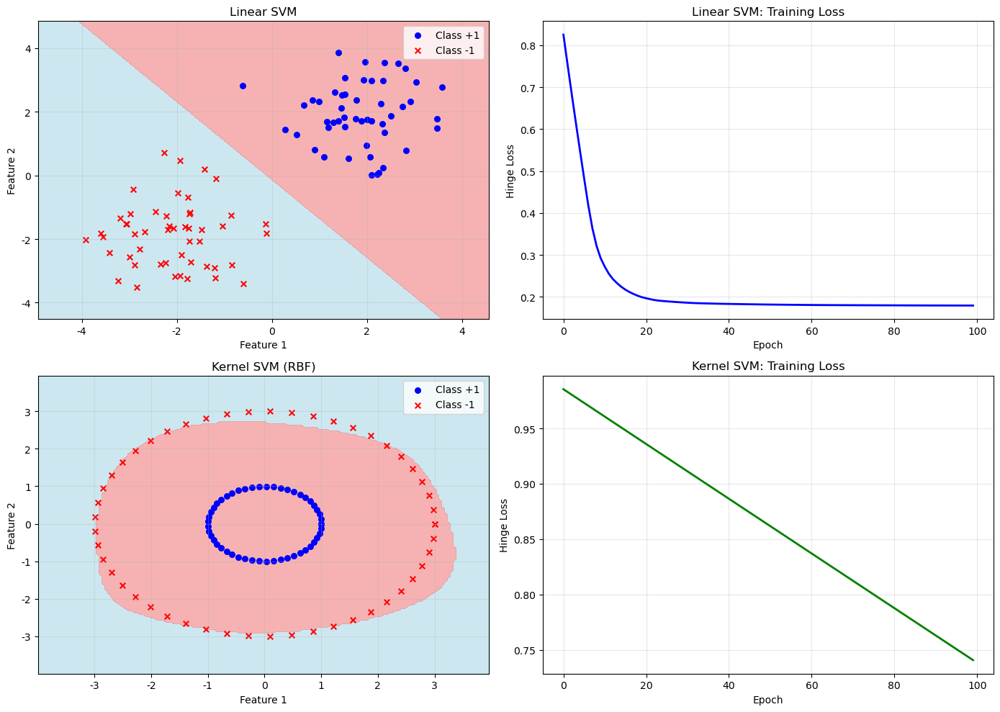

# 2.6 支持向量机与核方法

**版本：** v2.0
**最后更新：** 2026-05-27

## 核心概念

支持向量机（SVM）是一种强大的分类算法，通过**最大间隔**原理找到最优的决策边界。核方法则通过隐式地将数据映射到高维空间，使非线性问题变为线性问题。

### 线性SVM

**问题定义：** 找到参数 $w$ 和 $b$，使得决策边界 $w^T x + b = 0$ 最大化两类数据之间的间隔。

**优化问题：**
$$\min_{w,b} \frac{1}{2}\|w\|^2 + C \sum_{i=1}^{n} \max(0, 1 - y_i(w^T x_i + b))$$

其中第一项是正则化项，第二项是Hinge损失。

**Hinge损失：**
$$L_{\text{hinge}} = \max(0, 1 - y \cdot \hat{y})$$

- 当预测正确且置信度高时，损失为0
- 当预测错误或置信度低时，损失大于0

### 核方法（Kernel Methods）

**思想：** 通过核函数 $K(x_i, x_j)$ 隐式地计算高维空间中的内积，而无需显式地进行特征映射。

**常用核函数：**

| 核函数 | 公式 | 用途 |
|--------|------|------|
| 线性核 | $K(x_i, x_j) = x_i^T x_j$ | 线性可分问题 |
| 多项式核 | $K(x_i, x_j) = (x_i^T x_j + c)^d$ | 多项式特征 |
| RBF核 | $K(x_i, x_j) = \exp(-\gamma \|x_i - x_j\|^2)$ | 非线性问题 |
| Sigmoid核 | $K(x_i, x_j) = \tanh(\kappa x_i^T x_j + \theta)$ | 神经网络相似 |

**RBF核的直观理解：**
- 计算两个点之间的相似度
- 距离越近，相似度越高
- $\gamma$ 控制相似度的衰减速度

### 核技巧（Kernel Trick）

在SVM中，预测可以表示为：
$$\hat{y} = \text{sign}\left(\sum_{i=1}^{n} \alpha_i y_i K(x_i, x) + b\right)$$

其中 $\alpha_i$ 是拉格朗日乘数，只有支持向量对应的 $\alpha_i \neq 0$。

**优势：**
- 无需显式计算高维特征
- 计算复杂度不随维度增加而增加
- 可以处理无限维的特征空间

## 线性 vs 非线性

| 方面 | 线性SVM | 核SVM |
|------|---------|--------|
| **数据** | 线性可分 | 非线性可分 |
| **决策边界** | 直线/平面 | 曲线/曲面 |
| **核函数** | 线性核 | RBF/多项式核 |
| **计算复杂度** | 低 | 中等 |
| **泛化能力** | 一般 | 较好 |

## 代码实验

完整的代码示例位于：[`code/ch02_optimization/svm_kernel.py`](../../code/ch02_optimization/svm_kernel.py)

**运行方式：**
```bash
python code/ch02_optimization/svm_kernel.py
```

**代码包含：**
- 线性SVM的实现
- RBF核SVM的实现
- 决策边界可视化
- 性能对比


**代码文件：** [`code/ch02_optimization/svm_kernel.py`](../../code/ch02_optimization/svm_kernel.py)  
**运行方式：** `python code/ch02_optimization/svm_kernel.py`

*图2.6：线性SVM与RBF核SVM在决策边界上的对比。它说明核方法如何把原本线性不可分的问题转化为可分结构，也为后面理解“显式学习特征”与“隐式核映射”的区别提供直观参照。*

## 与深度学习的联系

### 核方法的本质

**SVM核方法的思想：**
- 通过核函数隐式地将数据映射到高维空间
- 在高维空间中进行线性分类
- 避免显式计算高维特征

**数学表达：**
```
原始空间 (低维)
    ↓ [隐式核映射 φ]
高维特征空间
    ↓ [线性分类]
决策边界
```

### 深度学习特征学习

**深度学习的思想：**
- 通过多层网络显式地学习特征映射
- 特征学习和分类同时进行（端到端优化）
- 可以学习任意复杂的特征表示

**数学表达：**
```
原始空间 (低维)
    ↓ [第1层：特征学习]
中间表示1
    ↓ [第2层：特征学习]
中间表示2
    ↓ [... 多层堆叠]
高维特征空间
    ↓ [输出层：分类]
决策边界
```

### 具体对比：非线性分类问题

**问题：** 分类XOR问题（两个特征，非线性可分）

**SVM核方法的方案：**
```
原始空间：(x₁, x₂)
    ↓ [RBF核隐式映射]
高维空间：φ(x) = [exp(-γ||x-c₁||²), exp(-γ||x-c₂||²), ...]
    ↓ [线性分类]
决策边界：w^T φ(x) + b = 0
```

**深度学习的方案：**
```
原始空间：(x₁, x₂)
    ↓ [隐层1：h₁ = σ(W₁x + b₁)]
中间表示：h₁ ∈ ℝ^d
    ↓ [隐层2：h₂ = σ(W₂h₁ + b₂)]
高维表示：h₂ ∈ ℝ^d'
    ↓ [输出层：y = σ(W₃h₂ + b₃)]
决策边界：自动学习
```

### 为什么深度学习比SVM更强大

#### 1. 特征学习的灵活性

**SVM核方法：**
- 核函数固定（RBF、多项式等）
- 特征映射由核函数决定
- 无法根据数据调整特征

**深度学习：**
- 特征映射由网络参数决定
- 可以根据数据自动调整特征
- 通过反向传播优化特征学习

#### 2. 端到端优化

**SVM核方法：**
- 特征映射和分类分离
- 只优化分类器参数
- 特征映射固定

**深度学习：**
- 特征学习和分类联合优化
- 所有参数同时更新
- 可以找到更优的特征表示

#### 3. 可扩展性

**SVM核方法：**
- 计算复杂度：O(n²) 或 O(n³)（n是样本数）
- 难以处理大规模数据
- 内存占用随样本数增加

**深度学习：**
- 计算复杂度：O(n)（使用小批量梯度下降）
- 可以处理数百万甚至数十亿样本
- 内存占用相对固定

#### 4. 表达能力

**SVM核方法：**
- 受限于核函数的选择
- 无法学习多层次的特征抽象
- 对复杂问题效果有限

**深度学习：**
- 多层堆叠可以学习多层次的特征
- 可以学习任意复杂的函数
- 对复杂问题（如图像、文本）效果优秀

### 支持向量 vs 神经网络中的关键样本

**SVM中的支持向量：**
- 只有支持向量对预测有贡献
- 其他样本可以忽略
- 模型紧凑，预测快速

**神经网络中的关键样本：**
- 所有样本都对训练有贡献
- 通过反向传播学习样本的重要性
- 模型学习所有样本的表示

### 核技巧 vs 深度学习中的隐层

**核技巧的思想：**
- 隐式地计算高维内积
- 避免显式特征计算
- 计算高效但特征固定

**深度学习隐层的思想：**
- 显式地计算中间表示
- 每层都是一个特征映射
- 特征可以根据数据学习

### 为什么LLM使用深度学习而不是SVM

1. **可扩展性**
   - SVM难以处理数十亿参数
   - 深度学习可以轻松扩展

2. **特征学习**
   - SVM的特征固定
   - 深度学习可以自动学习特征

3. **端到端优化**
   - SVM的特征和分类分离
   - 深度学习可以联合优化

4. **表达能力**
   - SVM受限于核函数
   - 深度学习可以学习任意复杂的函数

## 在LLM中的应用

### 核方法思想在LLM中的应用

虽然LLM不直接使用SVM，但核方法的思想在LLM中有深刻的应用：

1. **隐式特征映射 vs 显式特征学习**
   ```
   SVM核方法：
   原始空间 → [隐式核映射] → 高维空间 → 线性分类
   
   LLM：
   原始空间 → [显式特征学习] → 特征空间 → 分类
   优势：特征学习和分类同时优化，更灵活
   ```

2. **注意力机制中的核方法思想**
   - 自注意力：计算Token之间的相似度
   - 本质上是一种"核函数"
   - 衡量不同Token之间的关系

3. **多头注意力中的多核思想**
   - SVM中的多核学习：结合多个核函数
   - Transformer中的多头注意力：多个"注意力核"
   - 都是为了捕捉不同类型的关系

### 最大间隔原理在LLM中的应用

虽然LLM不直接使用最大间隔，但这个思想有间接的应用：

1. **对比学习（Contrastive Learning）**
   - 最大化正样本之间的相似度
   - 最小化负样本之间的相似度
   - 类似于SVM的最大间隔原理

2. **LLM的预训练目标**
   - 最大化正确Token的概率
   - 最小化错误Token的概率
   - 本质上是一种"间隔最大化"

### 核函数在LLM中的类比

1. **线性核 → 浅层注意力**
   - 直接计算Token之间的相似度
   - 捕捉局部关系

2. **RBF核 → 深层注意力**
   - 通过多层变换计算相似度
   - 捕捉复杂的长距离关系

3. **多项式核 → 多头注意力**
   - 多个不同的相似度计算方式
   - 捕捉不同类型的关系

### 为什么LLM比SVM更强大

1. **可扩展性**
   - SVM：O(n²)或O(n³)的复杂度
   - LLM：通过注意力机制可以处理任意长度的序列

2. **特征学习**
   - SVM：特征固定
   - LLM：自动学习特征

3. **端到端优化**
   - SVM：特征和分类分离
   - LLM：整个流程联合优化

4. **表达能力**
   - SVM：受限于核函数
   - LLM：可以学习任意复杂的函数

---

## 常见问题

**Q: 为什么SVM比逻辑回归更强大？**
A: SVM通过最大间隔原理和核方法，能处理更复杂的非线性问题。但在高维数据上，深度学习通常更有效。

**Q: 如何选择核函数？**
A: 
- 数据线性可分 → 线性核
- 数据有多项式关系 → 多项式核
- 数据非线性可分 → RBF核（最常用）

**Q: 核方法为什么不显式计算高维特征？**
A: 因为只需要计算内积 $K(x_i, x_j)$，而不需要知道具体的高维坐标。这样可以处理无限维的特征空间。

---

**下一步：** 阅读 [2.6 决策树与随机森林](07_decision_trees_random_forest.md)
