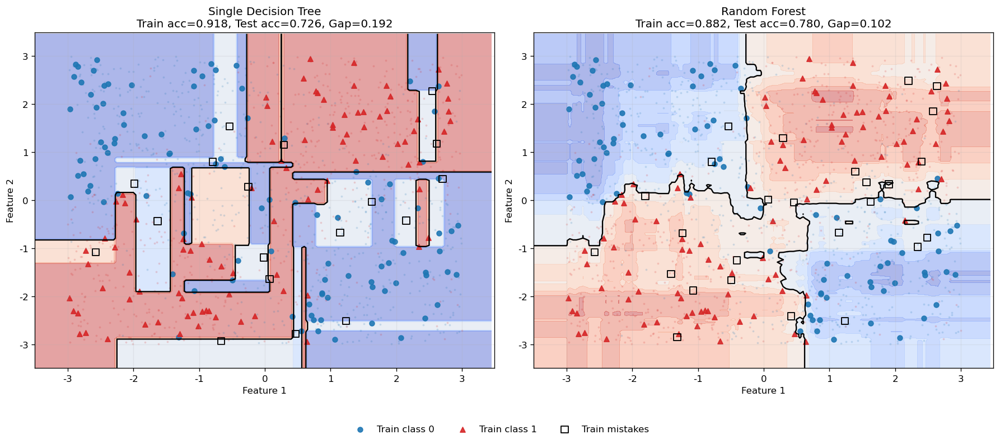

# 2.7 决策树与随机森林

**版本：** v2.0
**最后更新：** 2026-05-27

## 核心概念

决策树是一种直观的分类和回归算法，通过递归地分割特征空间来做预测。随机森林则通过集成多个决策树来提高泛化能力。

> **📚 深入学习：** 对树数据结构的实现细节感兴趣？请参考 [扩展：树数据结构基础](extensions/tree_data_structures.md)，其中包含树的遍历、递归实现、剪枝等内容。

### 决策树（Decision Tree）

**思想：** 通过一系列的"是/否"问题递归地分割数据，直到每个区域内的数据足够纯净。

**构建过程：**
1. 选择最佳分割特征和阈值
2. 将数据分为左右两个子集
3. 递归地对子集进行分割
4. 直到达到停止条件（最大深度、最小样本数等）

**分割标准：基尼系数（Gini Index）**

$$\text{Gini}(S) = 1 - \sum_{c=1}^{C} p_c^2$$

其中 $p_c$ 是类别 $c$ 在集合 $S$ 中的比例。

- **纯节点**（只有一个类别）：Gini = 0
- **混合节点**（多个类别）：Gini > 0

**最佳分割：** 选择使加权Gini最小的分割

$$\text{Gini}_{\text{split}} = \frac{|S_L|}{|S|} \text{Gini}(S_L) + \frac{|S_R|}{|S|} \text{Gini}(S_R)$$

### 随机森林（Random Forest）

**思想：** 通过Bootstrap采样和特征随机性，训练多个决策树，然后通过投票或平均来做预测。

**构建过程：**
1. 对原始数据进行Bootstrap采样（有放回地随机抽样）
2. 对每个Bootstrap样本训练一个决策树
3. 在每个节点，随机选择特征子集进行分割
4. 重复 $B$ 次（通常 $B=100$ 或更多）

**预测：**
- **分类**：多数投票
- **回归**：平均值

$$\hat{y} = \frac{1}{B} \sum_{b=1}^{B} \hat{y}_b$$

## 决策树 vs 随机森林

| 方面 | 决策树 | 随机森林 |
|------|--------|---------|
| **模型** | 单个树 | 多个树的集合 |
| **过拟合** | 容易过拟合 | 通过集成降低过拟合 |
| **可解释性** | 高（可视化） | 低（难以解释） |
| **计算复杂度** | 低 | 中等 |
| **泛化能力** | 一般 | 较好 |
| **特征重要性** | 可计算 | 可计算 |

## 集成学习的思想

随机森林体现了**集成学习**的核心思想：

$$\text{多个弱学习器} \rightarrow \text{强学习器}$$

**为什么有效？**
1. **多样性**：每个树学习不同的模式
2. **独立性**：Bootstrap采样和特征随机性保证独立性
3. **投票**：多数投票降低单个树的错误

**数学解释：**
假设每个树的错误率为 $\epsilon$，且树之间独立，则集成的错误率为：

$$P(\text{error}) = \sum_{k > B/2}^{B} \binom{B}{k} \epsilon^k (1-\epsilon)^{B-k}$$

当 $\epsilon < 0.5$ 时，$B$ 越大，集成错误率越低。

## 代码实验

完整的代码示例位于：[`code/ch02_optimization/decision_tree_random_forest.py`](../../code/ch02_optimization/decision_tree_random_forest.py)

**运行方式：**
```bash
python code/ch02_optimization/decision_tree_random_forest.py
```

**代码包含：**
- 决策树的实现
- 随机森林的实现
- 决策边界可视化
- 集成效果对比



*图2.7：单棵决策树与随机森林在同一带噪非线性分类任务上的决策边界对比。标题同时给出训练准确率、测试准确率和泛化间隙：单树更容易把训练集切得很碎，从而获得更高训练分数但更大的泛化损失；随机森林通过多棵树的平均让边界更平滑，测试表现也更稳定。*

## 与深度学习的联系

### 决策树的本质

**决策树的思想：**
- 通过递归分割特征空间进行分类
- 每个节点代表一个特征判断
- 叶子节点代表最终的预测

**数学表达：**
```
原始空间
    ↓ [特征1 > 阈值1?]
    ├─ 是 → [特征2 > 阈值2?]
    │       ├─ 是 → 类别A
    │       └─ 否 → 类别B
    └─ 否 → 类别C
```

### 神经网络的本质

**神经网络的思想：**
- 通过多层非线性变换进行分类
- 每层学习特征的非线性组合
- 多层堆叠可以学习复杂的决策边界

**数学表达：**
```
原始空间
    ↓ [隐层1：h₁ = σ(W₁x + b₁)]
中间表示1
    ↓ [隐层2：h₂ = σ(W₂h₁ + b₂)]
中间表示2
    ↓ [... 多层堆叠]
高维表示
    ↓ [输出层：y = softmax(Wₙhₙ + bₙ)]
类别预测
```

### 为什么类比有效

#### 1. 都是分类/回归

**决策树：**
- 通过分割特征空间进行分类
- 每个分割都是一个决策

**神经网络：**
- 通过非线性变换进行分类
- 每层都是一个决策

#### 2. 都可以学习复杂的决策边界

**决策树：**
- 轴对齐的矩形分割
- 可以学习任意复杂的分段线性决策边界

**神经网络：**
- 非线性变换
- 可以学习任意复杂的光滑决策边界

### 随机森林 → Transformer多头注意力

#### 集成学习的思想

**随机森林：**
- 多个决策树的集合
- 每个树学习不同的模式（通过Bootstrap采样和特征随机性）
- 通过投票或平均提高性能

**Transformer多头注意力：**
- 多个"注意力头"的融合
- 每个头学习不同的依赖关系
- 通过融合提高表达能力

#### 具体对比

```
随机森林：
  树1 → 预测1
  树2 → 预测2
  树3 → 预测3
  ↓ [投票/平均]
  最终预测

Transformer多头注意力：
  头1 → 表示1
  头2 → 表示2
  头3 → 表示3
  ↓ [融合]
  最终表示
```

#### 为什么Transformer更强大

1. **可学习的融合权重**
   - 随机森林：固定的投票权重
   - Transformer：学习的融合权重

2. **动态的"专家"**
   - 随机森林：每个树固定
   - Transformer：每个头可以根据输入动态调整

3. **全局依赖**
   - 随机森林：局部特征分割
   - Transformer：全局注意力机制

### 集成学习 → 模型融合

**集成学习的核心思想：**
- 多个弱学习器的组合
- 通过多样性提高性能
- 降低单个模型的错误

**现代深度学习中的应用：**
- 多任务学习：多个任务的联合优化
- 知识蒸馏：多个模型的知识融合
- 模型集成：多个模型的预测融合

### 为什么深度学习比决策树更强大

#### 1. 特征学习

**决策树：**
- 使用原始特征进行分割
- 无法学习新的特征表示

**神经网络：**
- 自动学习特征表示
- 多层堆叠可以学习多层次的特征

#### 2. 决策边界的光滑性

**决策树：**
- 轴对齐的矩形分割
- 决策边界不光滑

**神经网络：**
- 非线性变换
- 决策边界光滑，泛化能力更强

#### 3. 可扩展性

**决策树：**
- 树的深度受限（防止过拟合）
- 难以处理高维数据

**神经网络：**
- 可以任意深度堆叠
- 可以处理高维数据（如图像、文本）

#### 4. 端到端优化

**决策树：**
- 贪心分割，局部最优
- 无法全局优化

**神经网络：**
- 反向传播，全局优化
- 所有参数同时更新

### 为什么LLM使用Transformer而不是随机森林

1. **可扩展性**
   - 随机森林难以处理数十亿参数
   - Transformer可以轻松扩展

2. **特征学习**
   - 随机森林使用原始特征
   - Transformer自动学习特征

3. **全局依赖**
   - 随机森林局部分割
   - Transformer全局注意力

4. **端到端优化**
   - 随机森林贪心分割
   - Transformer全局优化

---

## 在LLM中的应用

### 集成学习思想在LLM中的应用

虽然LLM不直接使用随机森林，但集成学习的思想在LLM中有深刻的应用：

1. **多头注意力 ≈ 集成学习**
   ```
   随机森林：
   多个决策树 → [投票/平均] → 最终预测
   
   Transformer多头注意力：
   多个注意力头 → [融合] → 最终表示
   优势：注意力头可以学习不同的依赖关系
   ```

2. **为什么多头注意力更强大**
   - 随机森林：固定的投票机制
   - 多头注意力：可学习的融合权重
   - 可以根据任务自动调整不同头的重要性

### 特征分割思想在LLM中的应用

1. **决策树的特征分割**
   - 根据特征值分割数据
   - 学习特征之间的交互

2. **LLM中的特征交互**
   - 通过多层Transformer学习特征交互
   - 注意力机制捕捉不同Token之间的关系
   - 本质上是一种"软分割"

### 树结构在LLM中的类比

1. **决策树的层次结构**
   - 从根节点到叶子节点的路径
   - 每个节点代表一个决策

2. **Transformer的层次结构**
   - 从输入层到输出层的多层堆叠
   - 每层学习不同抽象级别的特征
   - 类似于决策树的层次决策

### 为什么LLM比随机森林更强大

1. **可扩展性**
   - 随机森林：难以处理数十亿参数
   - LLM：通过Transformer可以轻松扩展到数万亿参数

2. **特征学习**
   - 随机森林：使用原始特征或手工特征
   - LLM：自动学习多层次的特征表示

3. **全局依赖**
   - 随机森林：局部分割，只考虑局部特征
   - LLM：全局注意力，考虑所有Token之间的关系

4. **端到端优化**
   - 随机森林：贪心分割，局部最优
   - LLM：反向传播，全局优化

5. **表达能力**
   - 随机森林：受限于树的结构
   - LLM：可以学习任意复杂的函数

### 集成思想在LLM推理中的应用

1. **多个LLM的融合**
   - 类似于随机森林的多个树
   - 通过投票或平均提高预测质量

2. **Beam Search中的集成思想**
   - 保留多个候选序列
   - 最后选择最优的序列
   - 类似于集成学习的多个模型

3. **Temperature采样中的多样性**
   - 类似于随机森林的随机性
   - 增加模型的多样性
   - 提高生成文本的质量

---

## 常见问题

**Q: 决策树为什么容易过拟合？**
A: 决策树可以无限深地分割，直到每个叶子节点只有一个样本。这导致模型过度拟合训练数据。解决方法：限制树的深度、设置最小样本数、剪枝等。

**Q: 随机森林为什么比单个决策树更好？**
A: 通过Bootstrap采样和特征随机性，每个树学习不同的模式。多个树的投票降低了单个树的错误。

**Q: 如何计算特征重要性？**
A: 特征重要性 = 该特征在所有分割中降低的Gini总和。重要性高的特征对预测贡献大。

**Q: 随机森林能处理非线性问题吗？**
A: 可以。决策树通过分割特征空间，隐式地学习非线性决策边界。

---

**下一步：** 阅读 [2.3 优化算法与传统机器学习](03_optimization_and_traditional_ml.md)
