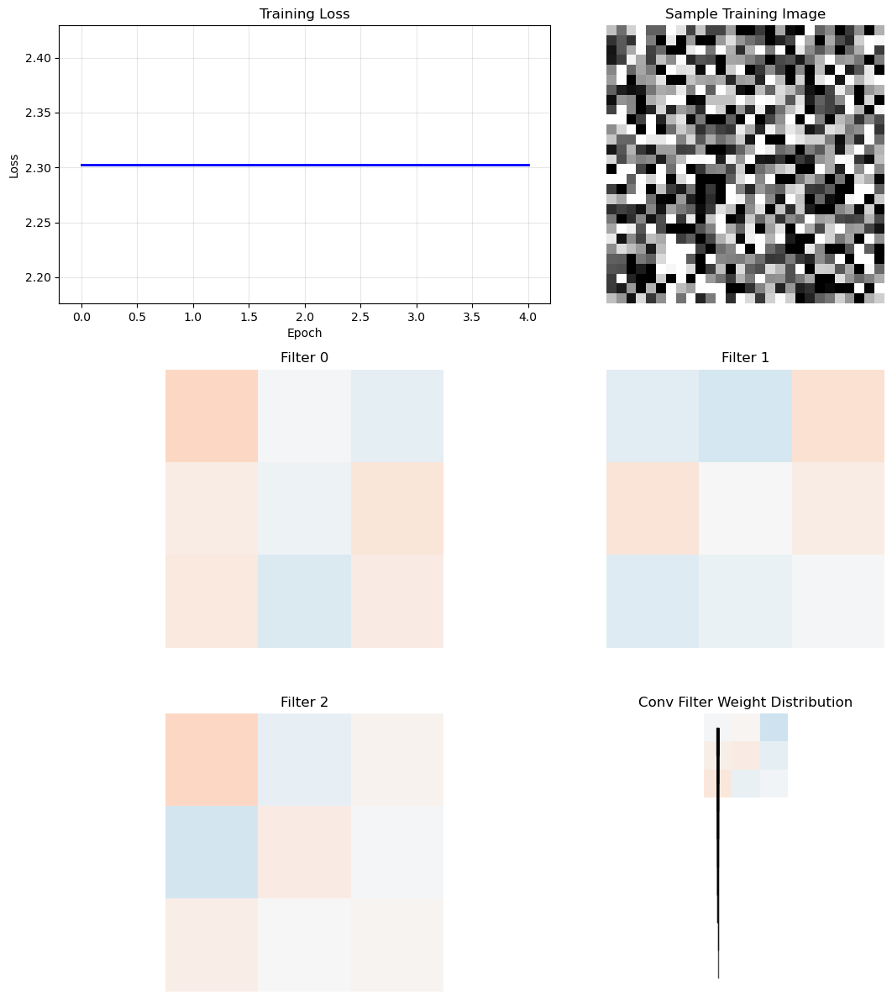

# 3.2 CNN的本质

**核心问题：** CNN如何工作？与DSP中的卷积有什么关系？

---

## CNN的基本结构

### 三个关键操作

1. **卷积（Convolution）**：提取特征
2. **激活（Activation）**：引入非线性
3. **池化（Pooling）**：降维

### 卷积层

**操作：** 用可学习的卷积核扫过输入，提取特征。

```
输入：28×28 图像
卷积核：3×3（可学习）
输出：26×26 特征图
```

**数学表达：**
$$y[i,j] = \sum_{m,n} x[i+m, j+n] \cdot w[m,n] + b$$

### 激活函数

**ReLU（最常用）：**
$$\text{ReLU}(x) = \max(0, x)$$

**作用：** 引入非线性，让网络能学习复杂函数。

### 池化层

**最大池化：**
$$y[i,j] = \max(x[i:i+k, j:j+k])$$

**作用：** 降维，提取最重要的特征。

---

## CNN与DSP的联系

**详见第1章：** [1.3 滤波器与卷积](../01_dsp/03_filters.md)

### 卷积核 = 可学习的滤波器

**DSP中的滤波器：**
- 固定的，设计好的
- 用来处理信号
- 详见 [1.3 滤波器与卷积](../01_dsp/03_filters.md)

**CNN中的卷积核：**
- 可学习的参数
- 网络自动学习最优的卷积核
- 与 [1.6 信号检测 - 匹配滤波器](../01_dsp/06_signal_detection.md#3-匹配滤波器matched-filter) 的思想相似：都是通过卷积实现最优的信息提取

### 启示

**CNN就是学习最优的滤波器。**

每个卷积层学习多个滤波器：
- 第1层：学习边界检测器
- 第2层：学习纹理检测器
- 第3层：学习形状检测器

---

## CNN的工作流程

### 例子：MNIST手写数字识别

```
输入：28×28 灰度图像
  ↓
卷积层1：32个3×3卷积核 → 26×26×32
  ↓
ReLU激活
  ↓
最大池化：2×2 → 13×13×32
  ↓
卷积层2：64个3×3卷积核 → 11×11×64
  ↓
ReLU激活
  ↓
最大池化：2×2 → 5×5×64
  ↓
展平：1600维向量
  ↓
全连接层：128维
  ↓
输出层：10维（0-9数字）
```

---

## 为什么CNN有效

### 1. 局部连接（Local Connectivity）

卷积核只看局部区域，减少参数。

### 2. 权重共享（Weight Sharing）

同一个卷积核在整个图像上共享，进一步减少参数。

### 3. 平移不变性（Translation Invariance）

同一个物体在不同位置，CNN都能识别。

### 4. 感受野逐层扩大

单个卷积核只能看到局部，但多层卷积叠加后，深层神经元能“看到”更大的区域。

```
浅层：边缘、角点、局部纹理
  ↓
中层：部分结构、重复模式
  ↓
深层：物体、场景、语义概念
```

这解释了为什么CNN既能提取局部细节，又能逐步形成整体理解。

### 5. 多通道特征图

CNN不是只学习一个滤波器，而是同时学习很多个卷积核。

- 一个卷积核可能关注水平边缘
- 一个卷积核可能关注竖直边缘
- 一个卷积核可能关注纹理或颜色变化

**结果：** 每一层都会形成多个特征图（feature maps），共同描述输入图像的不同方面。

---

## CNN的局限与视觉任务的扩展

CNN非常适合图像分类，但分类只回答一个问题：**图里有什么？**

更复杂的视觉任务还包括：
- **目标检测**：图里有什么？它在哪里？
- **图像分割**：图中每个像素属于什么？

这说明CNN不仅可以做分类，还可以作为更复杂视觉系统的特征提取骨干网络。

**但也有局限：**
- 主要依赖局部卷积，建模长距离关系不如自注意力直接
- 对小目标和复杂空间关系的理解需要更深结构或额外机制
- 对序列和跨模态任务不如Transformer通用

---



*图3.2：CNN在MNIST上的识别效果与特征提取结果示意。它把卷积、特征图和最终分类结果串起来，帮助读者把”可学习滤波器”这个抽象概念落到具体视觉任务上。*

**代码文件：** [`code/ch03_deep_learning_fast/mnist_cnn.py`](../../code/ch03_deep_learning_fast/mnist_cnn.py)  
**运行方式：** `python code/ch03_deep_learning_fast/mnist_cnn.py`

## 本节小结

CNN是深度学习在计算机视觉中的基础：
- 卷积核是可学习的滤波器
- 分层提取特征
- 局部连接和权重共享减少参数
- 感受野和多特征图让模型逐步形成语义理解
- 目标检测和图像分割都是在CNN特征提取基础上的进一步扩展

---

**下一节：** [3.3 从分类到检测：YOLO的核心思想](03_yolo_detection.md)
