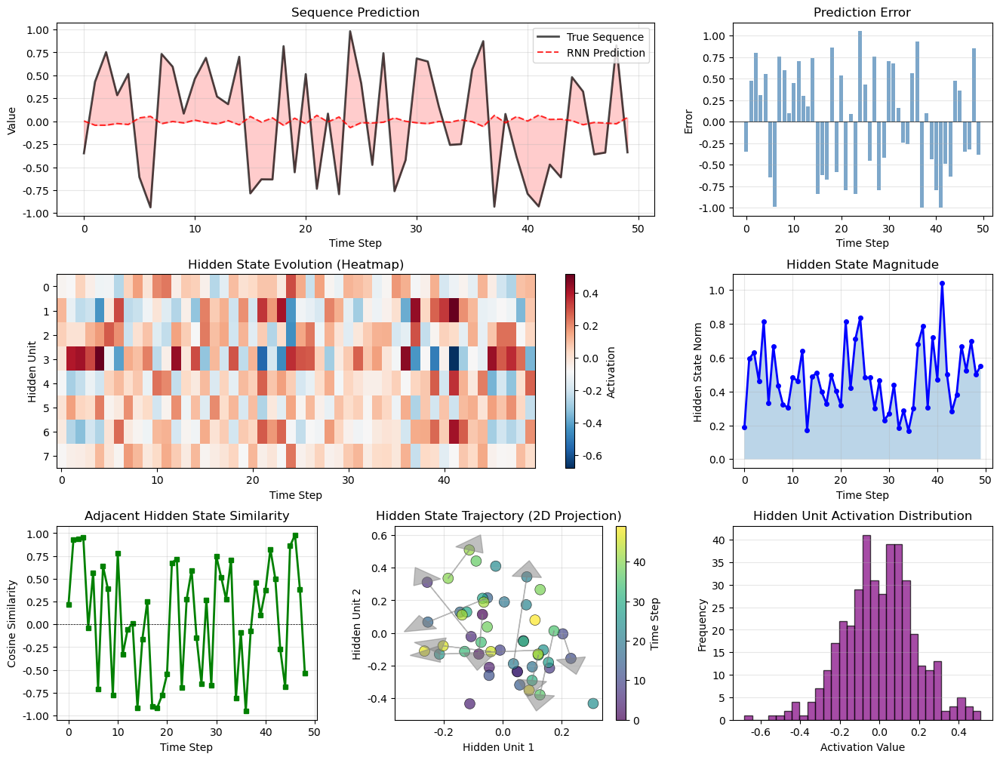
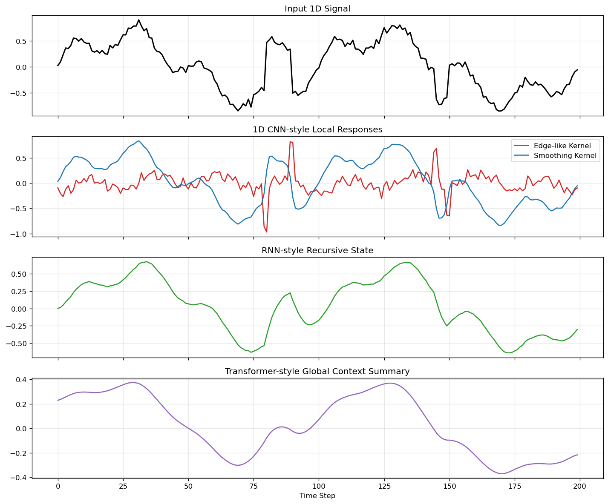

# 3.5 序列建模与一维信号处理

**核心问题：** 图像之外，深度学习如何处理时间序列、音频和其他一维信号？

---

## 技术背景

### 核心问题

前面介绍的CNN更擅长处理二维空间数据，如图像。但现实中还有大量一维信号和序列数据：文本、音频、传感器数据、医学时序、金融序列等。它们都要求模型理解“顺序”和“依赖关系”。

### 关键概念

| 概念 | 简单解释 |
|------|---------|
| **RNN** | 用隐状态递推处理序列 |
| **1D CNN** | 在时间轴上滑动卷积核提取局部模式 |
| **状态空间模型** | 用状态递推描述动态系统 |
| **长期依赖** | 当前输出依赖很久之前的输入 |

### 应用场景

- **文本建模**：句子、Token序列
- **音频处理**：语音、音乐、环境声音
- **传感器信号**：加速度计、心电图、工业时序
- **金融时间序列**：价格、成交量、波动模式

### 思考问题

- 为什么时序信号比静态图像更难处理？
- 1D CNN、RNN、Transformer各自适合什么依赖结构？

---

## 本节学习目标

完成本节后，你应该能够：
1. ✅ 理解RNN与状态空间模型的联系
2. ✅ 理解1D CNN如何处理一维信号
3. ✅ 理解1D CNN、RNN、Transformer在序列建模中的差异

---

## 序列数据的挑战

### 序列与图像的区别

图像主要强调空间结构，而序列数据强调时间顺序。

**序列数据的特点：**
- 长度可变
- 有明确顺序
- 当前输出可能依赖历史输入
- 依赖关系可能很短，也可能很长

**例子：**
- 文本：单词序列
- 音频：声波序列
- 时间序列：传感器读数序列

---

## RNN的基本思想

RNN在每个时刻都有一个隐状态，用来记忆历史信息。

```
h_t = f(h_{t-1}, x_t)
y_t = g(h_t)
```

其中：
- $h_t$：第t时刻的隐状态
- $x_t$：第t时刻的输入
- $y_t$：第t时刻的输出

### 直观理解

```
时刻1：h_1 = f(h_0, x_1)
时刻2：h_2 = f(h_1, x_2)
时刻3：h_3 = f(h_2, x_3)
...
```

隐状态像一个不断更新的“记忆”。

---

## RNN与状态空间模型的联系

### 状态空间模型

**状态转移方程：**
$$\mathbf{x}_{t+1} = \mathbf{A} \mathbf{x}_t + \mathbf{B} \mathbf{u}_t$$

**观测方程：**
$$\mathbf{y}_t = \mathbf{C} \mathbf{x}_t + \mathbf{D} \mathbf{u}_t$$

### RNN

**隐状态更新：**
$$h_t = \tanh(\mathbf{W}_{hh} h_{t-1} + \mathbf{W}_{xh} x_t + b_h)$$

**输出：**
$$y_t = \mathbf{W}_{hy} h_t + b_y$$

### 联系

RNN可以看作可学习的状态空间模型：
- 状态转移矩阵 $\mathbf{A}$ → 可学习的 $\mathbf{W}_{hh}$
- 输入矩阵 $\mathbf{B}$ → 可学习的 $\mathbf{W}_{xh}$
- 观测矩阵 $\mathbf{C}$ → 可学习的 $\mathbf{W}_{hy}$

这也是为什么RNN特别适合时间序列和动态系统建模。

---

## 1D CNN如何处理一维信号

RNN并不是处理序列的唯一方法。对于很多一维信号，1D CNN也很有效。

### 核心思想

1D CNN把卷积核沿时间轴滑动：

```
输入信号：x[1], x[2], x[3], ..., x[T]
卷积核：w[1], w[2], ..., w[k]
输出：局部模式响应
```

### 与DSP的联系

这和第1章的一维滤波非常接近：
- DSP中的滤波器：手工设计
- 1D CNN中的卷积核：自动学习

**可以把1D CNN理解为可学习的滤波器组。**

### 适用场景

1D CNN特别适合：
- 语音中的局部频谱模式
- ECG中的波形结构
- 传感器中的周期性模式
- 工业时序中的局部异常

---

## RNN的问题

### 梯度消失

反向传播时，梯度通过多个时刻相乘，容易变得很小：

$$\frac{\partial L}{\partial h_1} = \frac{\partial L}{\partial h_T} \prod_{t=2}^{T} \frac{\partial h_t}{\partial h_{t-1}}$$

如果这些导数长期小于1，梯度会指数衰减。

### 梯度爆炸

如果这些导数长期大于1，梯度会指数增长。

### 工程含义

这意味着RNN虽然有“记忆”，但并不总能稳定地保留很久之前的信息。

---

## LSTM和GRU

为了解决RNN的长期依赖问题，出现了门控结构：

### LSTM
- 遗忘门：决定丢弃哪些信息
- 输入门：决定写入哪些信息
- 输出门：决定输出哪些信息

### GRU
- LSTM的简化版本
- 参数更少
- 训练更高效

这些结构本质上是在改进“如何管理状态记忆”。

---

## 1D CNN vs RNN vs Transformer

### 1D CNN

**优势：**
- 并行计算快
- 擅长局部模式检测
- 很像可学习滤波器组

**局限：**
- 处理长距离依赖不够直接

### RNN

**优势：**
- 有显式状态递推
- 很适合动态系统和递推过程

**局限：**
- 难并行
- 长期依赖困难

### Transformer

**优势：**
- 更容易建模长距离依赖
- 支持并行训练
- 更通用

**局限：**
- 计算和内存成本较高

### 一个简单总结

```
1D CNN：擅长局部模式
RNN：擅长递推状态
Transformer：擅长全局依赖
```

这三类方法并不是互相完全替代，而是针对不同依赖结构有不同优势。

---

## 代码实验

完整的代码示例位于：[`code/ch03_deep_learning_fast/sequence_models_1d_signal.py`](../../code/ch03_deep_learning_fast/sequence_models_1d_signal.py)

**运行方式：**
```bash
python code/ch03_deep_learning_fast/sequence_models_1d_signal.py
```

---



*图3.5：RNN 的时间递推结构示意。它把隐状态如何沿时间轴传递信息画出来，有助于理解序列建模为什么天然依赖“记忆状态”，以及梯度消失为何会随着时间展开而出现。*



*图3.6：1D CNN、RNN 和 Transformer 在序列建模上的结构对比。它直观展示了三类模型分别偏向局部模式、递推状态和全局依赖，为后续进入 Transformer 章节做铺垫。*

## 本节小结

序列建模和一维信号处理展示了深度学习的另一条主线：
- RNN通过隐状态递推建模历史信息
- 1D CNN通过可学习卷积核检测局部时序模式
- 它们都与DSP中的滤波和状态空间建模密切相关
- Transformer则进一步提升了对长距离依赖的建模能力

---

**下一节：** [3.6 为什么Transformer更好](06_why_transformer_better.md)
