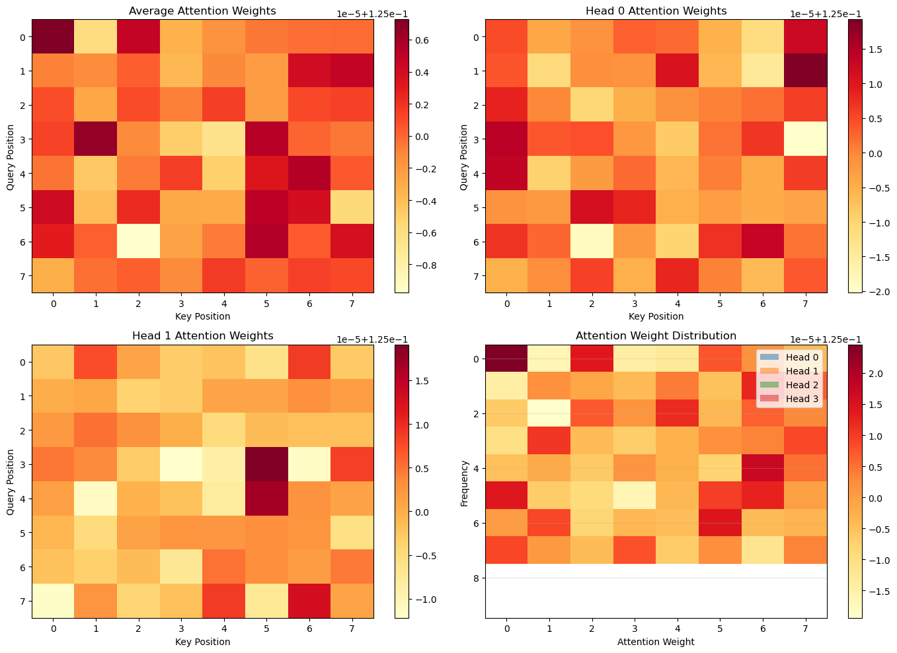
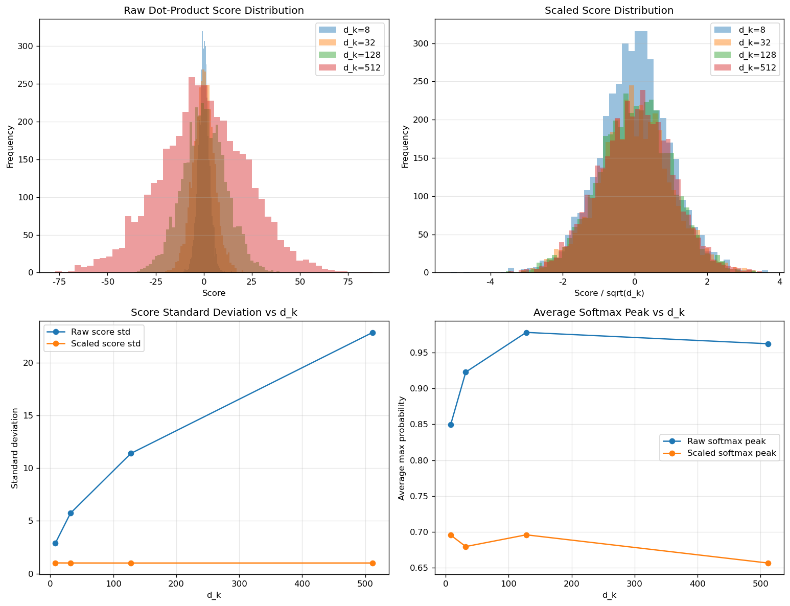

# 4.1 自注意力机制

**核心问题：** 什么是自注意力？它为什么能替代RNN成为现代序列建模的核心？

---

## 技术背景

### 核心问题

在处理序列时，模型不仅要知道“当前 token 是什么”，还要知道“它和序列里其他位置有什么关系”。RNN 用递推状态一步步传播信息，而自注意力选择了另一条路线：**直接计算任意两个位置之间的相关性，并按相关性动态聚合信息。**

### 关键概念

- **Query（Q）**：当前位置正在寻找什么信息
- **Key（K）**：每个位置暴露给别人匹配的特征
- **Value（V）**：每个位置真正携带的内容
- **Attention Score**：Q 和 K 的匹配程度
- **Attention Weight**：softmax 后得到的归一化关注强度
- **Mask**：人为限制哪些位置允许被看到

### 应用场景

- 文本理解中的上下文建模
- 机器翻译中的对齐关系
- 长序列依赖建模
- 图像 patch 与多模态 token 的全局交互

---

## 注意力的直观理解

### 类比：阅读

读一句话时，你不会平均看待所有单词，而是会根据当前词动态决定关注谁。

```text
"The cat sat on the mat"

当读 "sat" 时，你更关注 "cat" 和 "mat"
```

RNN 的做法更像是“把整句话压缩进一个不断更新的记忆状态里”；而自注意力的做法更像是“每读到一个词，就重新查看整句里与它最相关的部分”。

这就是 Transformer 的核心变化：**不再依赖串行记忆传播，而是直接建立全局关系。**

---

## 数学表达

$$\text{Attention}(Q, K, V) = \text{softmax}\left(\frac{QK^T}{\sqrt{d_k}}\right) V$$

其中：
- $Q$：查询（Query）— 当前位置想问什么
- $K$：键（Key）— 每个位置如何被匹配
- $V$：值（Value）— 每个位置真正提供的内容

这个公式可以拆成三步理解：
1. 用 $QK^T$ 计算“我和谁相关”
2. 用 softmax 把相关性变成权重分布
3. 用权重对 $V$ 做加权求和，得到新的表示

---

## 为什么需要 Q / K / V？

一个常见问题是：为什么不直接让 token 两两比较，然后加权求和？为什么要专门拆成 Q、K、V 三个投影？

原因是：**“我要找什么”、“我能和谁匹配”、“我真正携带什么内容”并不一定是同一件事。**

### 1. Query：决定当前 token 想找什么

当前位置并不是盲目地看全局，而是带着一个“查询意图”去寻找相关信息。比如在翻译或生成任务中，当前 token 可能更关心主语、时间信息、上一状态或局部搭配。

### 2. Key：决定其他 token 如何被匹配

每个位置都可以暴露一个适合被检索的“索引”。这和数据库里的 key 很像：它不一定等于全部内容，但它适合做匹配。

### 3. Value：决定真正被聚合的内容

模型最后拿回来参与融合的不是 key，而是 value。也就是说，一个位置可以用某种特征被找到，但返回的是更适合下游计算的内容表示。

### 核心直觉

如果不分 Q / K / V，模型就只能在同一个表示空间里同时完成“提问、匹配、返回内容”三件事，灵活性会弱很多。拆分之后，模型就能：
- 用一套子空间决定相关性
- 用另一套子空间保存内容
- 在训练中自动学习最合适的关系结构

这也是自注意力比简单相似度匹配更强的关键原因之一。

---

## 自注意力的计算步骤

### 1. 计算相似度

$$\text{scores} = QK^T$$

**含义：** 当前位置与其他位置的匹配程度。

点积越大，表示 query 和 key 的方向越接近，也就越可能说明这两个位置在当前任务下相关。

### 2. 缩放并归一化

$$\text{weights} = \text{softmax}\left(\frac{\text{scores}}{\sqrt{d_k}}\right)$$

**含义：** 把相似度变成概率式权重分布。

这里最容易被忽略的是除以 $\sqrt{d_k}$ 这一步，它并不是一个随手加上的技巧，而是稳定训练的重要设计。

### 为什么要除以 $\sqrt{d_k}$？

当 key/query 维度 $d_k$ 变大时，点积的数值幅度通常也会变大。这样一来，softmax 的输入就容易变得非常尖锐：
- 最大值对应的位置权重接近 1
- 其他位置权重接近 0
- 梯度变小，训练不稳定

除以 $\sqrt{d_k}$ 的作用，就是把分数重新压回一个更稳定的量级，让 softmax 不至于过早饱和。

可以把它理解成：**维度越高，点积天然越“膨胀”，所以必须做归一化。**

### 3. 加权求和

$$\text{output} = \text{weights} \cdot V$$

**含义：** 按照关注强度，对所有位置的内容做加权融合。

输出不是简单复制某一个 token，而是把多个相关位置的信息整合成当前位置的新表示。

---

## Mask 为什么重要？

注意力最大的能力，是任意位置之间都能直接交互；但在很多任务里，**并不是所有位置都应该互相可见。**

这就需要 mask 来控制信息流方向。

### 1. Padding Mask

有些序列长度不一致，需要补齐空白位置。padding mask 的作用是告诉模型：
- 这些补齐位置不是真实内容
- 计算注意力时不要关注它们

### 2. Causal Mask

在语言生成任务里，模型预测当前位置时不能偷看未来 token。

例如生成第 5 个词时，只允许看第 1 到第 5 个词，不能看第 6 个词以后。这就是 causal mask 的作用。

它决定了 Transformer 能否变成真正的自回归生成模型，也正是它把“通用注意力机制”推进成了“decoder-only LLM”的核心组件。

---

## 为什么自注意力比 RNN 更强？

### 1. 长距离依赖路径更短

RNN 中，前后两个位置要通过很多时间步逐步传播信息；距离越远，信息越容易衰减。

自注意力里，任意两个位置都可以直接交互，路径长度近似为 1。

### 2. 可并行化

RNN 必须按时间步顺序计算，而自注意力可以一次性计算整个序列的相关性矩阵，因此更适合 GPU 并行训练。

### 3. 动态上下文建模

卷积更强调局部模式，RNN 更强调递推状态，自注意力则能根据当前 token 动态选择全局上下文，这使它在复杂依赖关系上更灵活。

### 4. 更容易扩展

当模型规模变大、数据量变大时，自注意力的表达能力和训练效率更容易随之提升，这为大模型时代奠定了基础。

---

## 与向量空间和线性代数的联系

从线性代数角度看，自注意力并不神秘：
- $QK^T$ 是一组向量间的相似度矩阵
- softmax 把相似度变成归一化权重
- 权重矩阵再去乘 $V$，得到新的线性组合

因此，自注意力本质上可以理解为：**基于内容相关性的动态线性组合。**

和固定卷积核不同，这里的“滤波器”不是 заранее 写死的，而是由输入内容本身动态生成的。

---

## 实验结果



*图4.1：自注意力权重可视化。左上：所有头的平均注意力权重热力图。右上：不同头的权重分布。左下与右下：两个注意力头学到的不同模式。*

**代码文件：** [`code/ch04_transformer/self_attention.py`](../../code/ch04_transformer/self_attention.py)  
**运行方式：** `python code/ch04_transformer/self_attention.py`

---

## 实验延伸：缩放点积注意力

除了基本的注意力热力图，本章还提供一个更聚焦的问题实验：为什么注意力分数必须除以 $\sqrt{d_k}$？

- **代码实验：** [`code/ch04_transformer/scaled_attention_demo.py`](../../code/ch04_transformer/scaled_attention_demo.py)
- **作用：** 展示维度增大时，未缩放点积如何让 softmax 变得过尖，而缩放后分数分布更稳定



*图4.2：缩放前后注意力分数分布对比。展示 `sqrt(d_k)` 对训练稳定性的作用。*

**代码文件：** [`code/ch04_transformer/scaled_attention_demo.py`](../../code/ch04_transformer/scaled_attention_demo.py)  
**运行方式：** `python code/ch04_transformer/scaled_attention_demo.py`

---

## 本节小结

自注意力机制的核心不是“加权平均”这么简单，而是：
- 用 Q / K / V 把检索、匹配、内容聚合分开
- 用缩放稳定 softmax 的数值范围
- 用 mask 控制信息是否允许流动
- 用全局并行关系建模替代串行递推

正因为如此，Transformer 才能在长距离依赖、并行训练和大规模扩展上全面超越传统 RNN。

---

**下一节：** [4.2 多头注意力](02_multihead.md)
