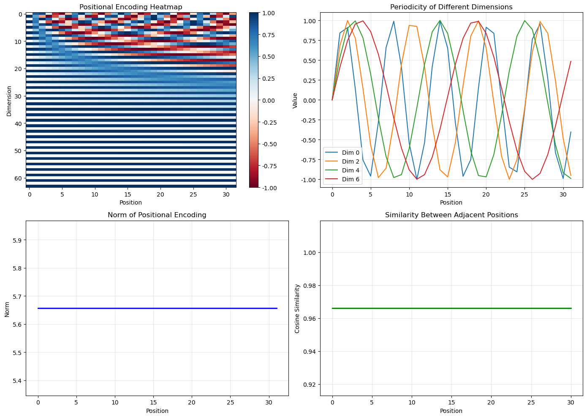

# 4.3 位置编码

**核心问题：** Transformer 如何理解序列顺序？为什么注意力机制本身还不够？

---

## 技术背景

### 核心问题

自注意力可以让任意两个位置直接交互，但它本身并不知道 token 的先后顺序。

这意味着，如果我们只把一组 token 向量送进 attention，而不额外提供位置信息，那么模型只能知道“有哪些内容”，却不知道“谁在前、谁在后、谁彼此相邻”。

### 关键概念

- **Permutation Invariance（置换不变性）**：如果不引入位置信息，attention 对 token 顺序本身不敏感
- **Positional Encoding**：把位置信息编码进输入表示
- **Absolute Position**：当前位置在整个序列中的编号
- **Relative Position**：两个位置之间的相对距离关系
- **Sinusoidal Encoding**：用不同频率的正弦/余弦函数表示位置

### 应用场景

- 文本中的词序理解
- 音频和时间序列中的先后关系
- 图像 patch 序列中的空间排列
- 长上下文生成中的位置泛化

---

## 为什么位置是个问题？

看下面两个句子：

```text
"The cat sat on the mat"
"mat the on sat cat The"
```

如果只把它们看作一组 token 内容，而不加位置信号，那么自注意力只会看到同一组词向量，只是排列顺序不同。

问题在于，语言、音频和时间序列都不是“无序集合”，而是**顺序决定意义**的结构。

- “狗咬人”和“人咬狗”词几乎一样，但顺序不同，含义完全不同
- 音频中的波形顺序代表时间演化
- 传感器序列中的先后关系决定动态状态

所以，Transformer 必须额外知道：
- 某个 token 处在什么位置
- 不同 token 之间谁更近、谁更远

---

## 为什么自注意力本身不知道顺序？

自注意力做的是：
- 用 query 和 key 计算相似度
- 用相似度决定权重
- 对 value 做加权求和

这里的相关性来自“内容表示”的点积，而不是“索引顺序”。

换句话说，attention 本质上是在回答：
- “哪些位置和我相关？”

但它不会自动回答：
- “哪个位置在我前面？”
- “谁离我最近？”
- “这是第几个 token？”

因此，如果不显式加入位置信号，Transformer 的表达会缺掉序列最基础的结构信息。

---

## 解决方案：位置编码

最直接的思路是：**给每个位置配一个位置向量，再把它加到 token embedding 上。**

这样，输入给 Transformer 的就不再只是“词的内容”，而是：

$$\text{input representation} = \text{token embedding} + \text{position encoding}$$

这样一来：
- token embedding 提供“是什么”
- position encoding 提供“在哪里”

两者相加后，模型就能同时利用内容和顺序信息。

---

## 正弦位置编码

Transformer 原始论文采用的是正弦/余弦位置编码：

$$PE(pos, 2i) = \sin\left(\frac{pos}{10000^{2i/d}}\right)$$
$$PE(pos, 2i+1) = \cos\left(\frac{pos}{10000^{2i/d}}\right)$$

其中：
- $pos$：位置索引
- $i$：维度索引
- $d$：模型维度

### 直观理解

不同维度对应不同频率的波形：

```text
低频维度：变化慢，适合表示较粗的全局位置
高频维度：变化快，适合区分相邻位置和局部变化
```

因此，一个位置不是用单一数字表示，而是用一组不同频率的波共同编码。

这让模型能同时感知：
- 绝对位置的大致范围
- 相邻位置之间的细粒度差异

---

## 为什么正弦编码有效？

### 1. 不同位置有不同表示

每个位置都会得到一组独特的频率组合，因此模型能够区分第 3 个 token 和第 30 个 token。

### 2. 相邻位置之间有平滑变化

位置编码不是离散跳变的 one-hot，而是连续变化的波形。这让模型更容易学习“邻近位置通常更相关”这样的规律。

### 3. 能表达相对距离结构

不同位置之间的关系，会反映为这些正弦/余弦分量之间的相位差。也就是说，模型不仅能区分“这是第几个位置”，还可以从表示变化中感受到“两个位置差了多远”。

### 4. 对更长序列有一定泛化能力

因为位置编码来自固定函数，而不是只记住训练集中见过的位置索引，所以它比纯学习式表更容易外推到更长序列。

---

## 与傅里叶思想的联系

这一节和前面 DSP 内容的联系非常直接。

### 傅里叶变换

用不同频率的正弦波表示信号。

### 位置编码

用不同频率的正弦波表示位置。

```text
傅里叶变换：信号 = 多种频率成分的组合
                    ↓
位置编码：位置 = 多种频率成分的组合
```

**启示：** 位置编码本质上是在用频率基来表示序列中的顺序结构。

也正因为如此，它不是一个随意设计的工程技巧，而是和信号表示思想高度一致的结构设计。

---

## 绝对位置 vs 相对位置

### 绝对位置

“这是第 1 个 token，还是第 100 个 token？”

正弦位置编码最直接表达的是绝对位置：每个位置都有自己的编码。

### 相对位置

“这个 token 比另一个 token 靠前几个位置？”

很多任务里，模型真正关心的并不是绝对编号，而是相对距离。例如：
- 当前词与前一个词的关系
- 当前 patch 与邻近 patch 的关系
- 当前时间点与前几步状态的关系

因此，后续很多 Transformer 变体开始更强调相对位置建模。

---

## 为什么后来会出现 RoPE 等现代变体？

原始正弦位置编码已经很好，但仍有局限：
- 绝对位置表达较强，相对位置建模不够直接
- 在超长上下文场景下，位置外推能力仍然有限
- 与注意力分数的结合方式还可以更自然

这就是为什么后来出现了：
- **Relative Position Encoding**：显式建模相对距离
- **RoPE（Rotary Positional Embedding）**：把位置信息通过旋转方式注入 query / key，使相对位置信息更自然地反映到点积中

在本教程里，不需要把 RoPE 展开成完整实现，但要知道：**现代 LLM 并没有放弃位置问题，而是在持续改进位置注入方式。**

---

## 位置编码在不同模态中的意义

位置编码不仅用于文本。

### 文本
- 表示词序和上下文结构

### 音频 / 时间序列
- 表示时间先后和动态演化

### 图像 Transformer
- 表示 patch 在二维空间中的相对布局

因此，位置编码可以理解为：**把“顺序或空间结构”注入原本只关注内容的注意力机制中。**

---

## 实验结果



*图4.4：位置编码的结构。左上：热力图显示不同维度在不同位置的值（低频维度变化慢，高频维度变化快）。右上：不同维度的周期性曲线。左下：位置编码的范数（近似常数）。右下：相邻位置的相似度（编码了相对距离信息）。*

**代码文件：** [`code/ch04_transformer/positional_encoding.py`](../../code/ch04_transformer/positional_encoding.py)  
**运行方式：** `python code/ch04_transformer/positional_encoding.py`

---

## 本节小结

位置编码解决的核心问题不是“给每个 token 编号”这么简单，而是：
- 让 Transformer 从无序内容集合变成能理解顺序的序列模型
- 用频率结构把位置表示成连续向量
- 让模型既能感知绝对位置，也能间接利用相对距离
- 为后续 RoPE、相对位置编码等现代设计打下基础

没有位置编码，Transformer 很强的全局建模能力就会失去序列结构这个最基本的前提。

---

**下一节：** [4.4 完整架构](04_architecture.md)
