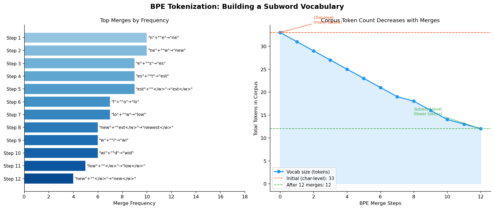
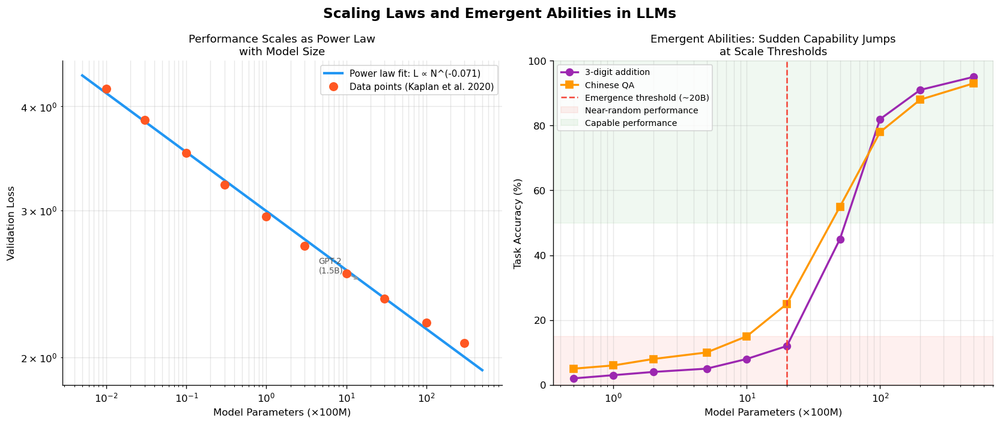
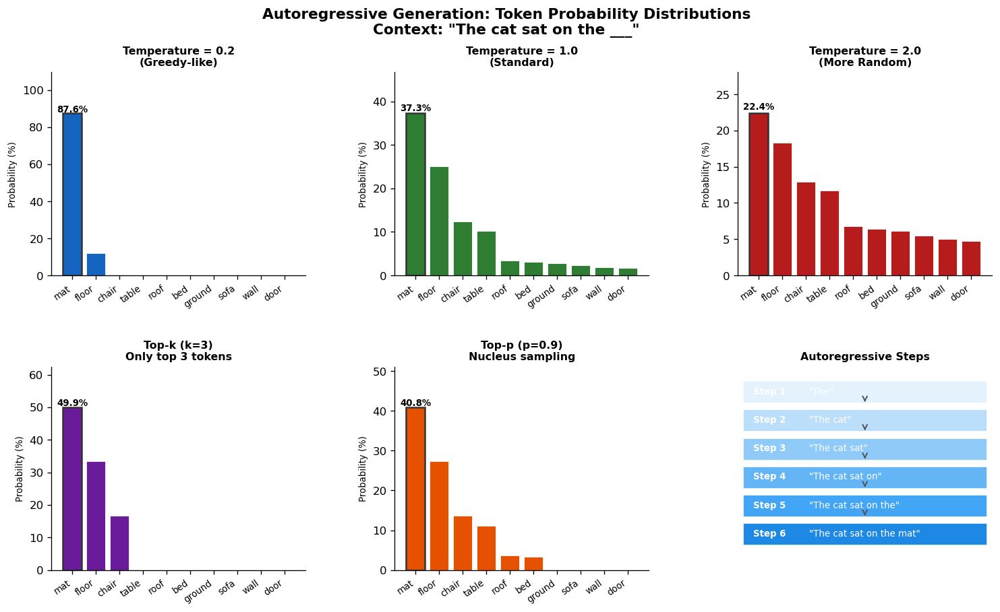

# 5.1 预训练：从 Transformer 到语言模型

**核心问题：** Transformer 是通用序列架构，LLM 是怎么从它演化出来的？预训练为什么能让模型从无标注文本中学到知识？

**前置章节：** [第4章：Transformer详解](../04_transformer/README.md)

---

## 从 Transformer 到语言模型

第4章介绍了 Transformer 的核心机制：自注意力、位置编码、残差连接。但 Transformer 本身只是一个**序列处理架构**，不天然是语言模型。

从 Transformer 到 LLM，需要三个关键步骤：

```
Transformer 架构
    ↓ 选择 decoder-only 结构（因果掩码）
    ↓ 定义自回归训练目标（预测下一个 token）
    ↓ 解决文字表示问题（Tokenization + Embedding）
GPT 风格的语言模型
    ↓ 大规模数据 + 大规模计算
LLM
```

---

## Tokenization：把文字变成数字

神经网络只能处理数字，文字必须先转换为 token（词元）。

### 为什么不直接用字符或单词

**字符级别：** 序列太长，"hello world" = 11 个字符，注意力计算代价随序列长度平方增长。

**单词级别：** 词表太大（英语 50 万词），且无法处理新词、拼写错误、代码等。

### BPE（字节对编码）

现代 LLM 使用 BPE（Byte Pair Encoding）在字符和单词之间找平衡：

```
初始：把文本拆成字符
      h e l l o   w o r l d

迭代：找最高频的相邻字符对，合并
      第1轮：'l' + 'o' 最频繁 → 'lo'
      h e l lo   w o r l d
      第2轮：'h' + 'e' 最频繁 → 'he'
      he l lo   w o r l d
      ...直到词表达到目标大小（如 50,000）
```

**结果：** 常见词变成单个 token，罕见词被拆成子词片段。

```
"unhappiness" → ["un", "happiness"]
"ChatGPT"     → ["Chat", "G", "PT"]
"def foo():"  → ["def", " foo", "():"]
```

| 词表大小 | 序列长度 | 覆盖能力 |
|---------|---------|---------|
| 小（~10K） | 长 | 差（生僻词被拆碎） |
| 大（~100K） | 短 | 好（更多完整词） |

GPT-4 使用约 100K 词表，在序列长度和覆盖能力之间取得平衡。

---

## Token Embedding：从离散符号到连续向量

Tokenization 把文字变成整数 ID（如 "cat" → 1234），但神经网络需要的是**连续向量**，不是整数。

### Embedding 层

每个 token ID 对应一个可学习的向量，存储在 **Embedding 矩阵** 中：

```
词表大小 = 50,000，向量维度 = 4096

Embedding 矩阵形状：[50000, 4096]

"cat"（ID=1234）→ 取第 1234 行 → 一个 4096 维向量
```

这个向量就是 token 的**语义表示**，在训练过程中和模型其他参数一起学习。

训练后，语义相近的词在向量空间中距离更近：

```
"cat" ≈ "dog" ≈ "kitten"（都是动物）
"king" - "man" + "woman" ≈ "queen"（经典类比）
```

这不是人工设计的，而是模型从大量文本中**自动学到**的语义结构。

### 完整的输入处理流程

```
文本 → Tokenizer → Token IDs → Embedding 层 → Token 向量序列
                                                    ↓
                                            Transformer 层（注意力 + FFN）
                                                    ↓
                                            输出向量 → 预测下一个 token 的概率
```

输出端的投影层通常与 Embedding 矩阵**共享权重**（weight tying），减少参数量，同时保证输入输出语义空间一致。

---

## Decoder-only 架构

第4章提到了三种 Transformer 变体，LLM 为什么选择 decoder-only？

| 变体 | 代表模型 | 注意力方向 | 适合任务 |
|------|---------|-----------|---------|
| Encoder-only | BERT | 双向（看全文） | 理解：分类、NER |
| Encoder-Decoder | T5、翻译模型 | 编码器双向，解码器因果 | 翻译、摘要 |
| **Decoder-only** | **GPT 系列** | **因果（只看左边）** | **生成：续写、对话** |

**训练目标天然统一：** 只需预测下一个 token，不需要设计特殊的任务格式。

```
输入：The cat sat on the
目标：cat sat on the mat
```

每个位置都在做预测，整个序列都是训练信号，数据利用率极高。

**生成任务的自然契合：** 对话、写作、代码生成都是"给定上文，续写下文"，decoder-only 的因果掩码天然匹配这个模式。

**规模化更简单：** 不需要维护编码器和解码器两套参数，架构更统一，更容易扩展到数千亿参数。

---

## 预训练：在无标注文本上学习

### 传统监督学习的瓶颈

```
任务1：需要 10 万条标注数据
任务2：需要 10 万条标注数据
任务3：需要 10 万条标注数据
```

标注数据昂贵，且每个任务的模型无法复用。

### 预训练的核心思想

用海量**无标注**文本训练一个通用模型，让它学会预测下一个 token：

$$\mathcal{L} = -\sum_{t=1}^{T} \log P(w_t \mid w_1, w_2, \ldots, w_{t-1})$$

这个目标看起来简单，但要做好它，模型必须学会：
- **语法**：什么词在语法上可以跟在后面
- **语义**：什么词在语义上合理
- **事实**：世界上发生了什么（"巴黎是法国的..."）
- **推理**：如何从前提推出结论

**关键洞察：** 预测下一个词是一个"万能代理任务"——要预测得准，就必须理解语言的一切。

### 自回归生成

训练好的模型如何生成文字？

```
输入 prompt：["The", "cat"]
    ↓ 模型预测下一个 token 的概率分布
    P("sat") = 0.3, P("is") = 0.2, P("was") = 0.15, ...
    ↓ 采样
    选择 "sat"
    ↓ 把 "sat" 加入序列，继续预测
输入：["The", "cat", "sat"]
    ↓ 预测下一个...
```

每次只生成一个 token，然后把它加入输入，再预测下一个——这就是**自回归**（auto-regressive）。

| 采样策略 | 方法 | 效果 |
|---------|------|------|
| Greedy | 每次取概率最大的 token | 确定但重复 |
| Temperature | 调整概率分布的"尖锐度" | 控制随机性 |
| Top-k | 只从概率最高的 k 个中采样 | 避免低概率词 |
| Top-p (nucleus) | 从累积概率达到 p 的词中采样 | 更自然 |

---

## Scaling Laws：规模就是能力

### 幂律关系

OpenAI 2020 年的研究发现，模型性能与规模之间存在稳定的幂律关系：

$$L(N) \propto N^{-\alpha}, \quad L(D) \propto D^{-\beta}, \quad L(C) \propto C^{-\gamma}$$

其中 $N$ 是参数量，$D$ 是数据量，$C$ 是计算量，$\alpha \approx \beta \approx \gamma \approx 0.07$。

**含义：** 性能随规模单调提升，没有饱和点——只要加大规模，模型就会变好。

### 最优计算分配：Chinchilla 定律

给定固定的计算预算，应该用大模型+少数据，还是小模型+多数据？

**Chinchilla（2022）的结论：** 最优数据量 ≈ 20 × 参数量

```
GPT-3：175B 参数，300B tokens（数据不足）
Chinchilla：70B 参数，1.4T tokens（更优配比）

结果：Chinchilla 用更少参数，性能反而更好
```

**实践影响：** LLaMA、Mistral 等后续模型都遵循 Chinchilla 定律，用更多数据训练更小的模型。

### 涌现能力

当模型规模超过某个阈值，会**突然出现**之前没有的能力：

```
In-Context Learning：
  小模型（<1B）：无法从示例中学习
  大模型（>10B）：看几个例子就能完成新任务

Chain-of-Thought：
  小模型：直接输出答案，错误率高
  大模型（>100B）：一步步推理，准确率大幅提升
```

这种"量变引起质变"的现象是 LLM 最令人惊讶的特性之一。

---

## GPT 系列演化

从 Transformer 论文（2017）到 ChatGPT（2022），发生了什么？

```
2017  Transformer 论文（Attention is All You Need）
      — 提出 encoder-decoder 架构，用于机器翻译

2018  GPT-1（1.17 亿参数）
      — 第一个 decoder-only 预训练语言模型
      — 证明：预训练 + 微调 在 NLP 任务上有效

2019  GPT-2（15 亿参数）
      — 规模扩大 10 倍
      — 发现：足够大的模型可以 zero-shot 完成任务

2020  GPT-3（1750 亿参数）
      — 规模再扩大 100 倍
      — 涌现能力：few-shot learning 无需微调
      — 证明：规模本身就是能力

2022  InstructGPT / ChatGPT
      — GPT-3 + RLHF 对齐
      — 从"预测文字"变成"听从指令"

2023+ GPT-4、LLaMA、Claude、Gemini...
      — 多模态、更长上下文、更强推理
```

**关键洞察：** GPT-1 到 GPT-3 的核心变化只有一个——**规模**。架构几乎没变，但能力发生了质变。

---

## 与第4章的连接

| 第4章概念 | 在 LLM 中的体现 |
|----------|---------------|
| Decoder-only + 因果掩码 | GPT 的核心架构，保证生成时不看未来 |
| 位置编码（正弦） | LLM 用 RoPE（旋转位置编码）替代，支持更长上下文 |
| 残差连接 + LayerNorm | 使数百层的深层网络可训练 |
| FFN 层 | 被认为存储了模型的"知识"（key-value 记忆） |

---

## 代码实验



*图5.1a：BPE 分词算法演示——词表构建过程与常见 token 的合并规则。*

**代码文件：** [`code/ch05_llm_basics/bpe_tokenization.py`](../../code/ch05_llm_basics/bpe_tokenization.py)  
**运行方式：** `python code/ch05_llm_basics/bpe_tokenization.py`



*图5.1b：Scaling Laws 曲线——模型参数量、数据量与计算量对损失的影响，以及涌现能力的出现阈值。*

**代码文件：** [`code/ch05_llm_basics/scaling_laws.py`](../../code/ch05_llm_basics/scaling_laws.py)  
**运行方式：** `python code/ch05_llm_basics/scaling_laws.py`



*图5.1c：自回归生成过程——每步预测下一个 token 的概率分布，以及 temperature/top-p 采样对输出多样性的影响。*

**代码文件：** [`code/ch05_llm_basics/autoregressive_generation.py`](../../code/ch05_llm_basics/autoregressive_generation.py)  
**运行方式：** `python code/ch05_llm_basics/autoregressive_generation.py`

---

## 本节小结

- **Tokenization（BPE）** 解决了文字到数字的转换，在序列长度和词表覆盖之间取得平衡
- **Decoder-only** 架构因训练目标统一、生成任务契合、规模化简单而成为 LLM 主流
- **预训练** 用"预测下一个词"这个代理任务，让模型从无标注文本中学到语言、知识和推理能力
- **Scaling Laws** 揭示了规模与性能的幂律关系，Chinchilla 定律指导了最优计算分配
- **涌现能力** 是规模超过阈值后突然出现的新能力，是 LLM 最重要的特性之一

---

**下一节：** [5.2 训练数据](02_training_data.md)
