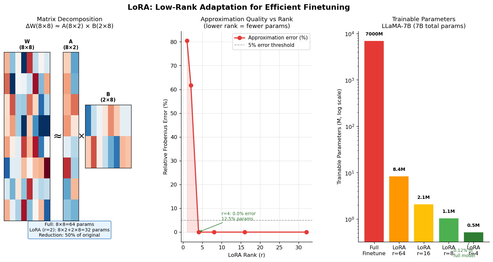

# 5.4 微调

**核心问题：** 预训练模型已经很强，为什么还需要微调？微调的原理是什么？如何选择合适的基础模型？

---

## 微调在训练流程中的位置

```
预训练（海量无标注文本）
    ↓ 学到通用语言能力和知识
基础模型（Base Model）
    ↓ 微调（有标注数据）
    ├─ SFT（指令微调）→ 学会听从指令
    └─ 任务微调 → 适配特定领域
适配后的模型
    ↓ 强化学习对齐（见 5.5）
可用的 LLM 助手
```

**基础模型的问题：** 预训练只教会了模型"预测下一个词"，它不知道如何回答问题、不知道什么是有用的回答、也不知道如何遵循指令。

---

## SFT：指令微调

SFT（Supervised Fine-Tuning，监督微调）是最基础的微调形式。

### 数据格式

```
指令-回答对：
  指令：请将以下英文翻译成中文：Hello, world!
  回答：你好，世界！

  指令：写一首关于春天的诗
  回答：春风轻抚柳梢头，...

  指令：解释什么是梯度下降
  回答：梯度下降是一种优化算法...
```

### SFT 学到了什么

SFT 不是在教模型新知识——预训练已经学到了知识。SFT 是在教模型**如何表达**：

```
预训练后的模型：
  输入："请解释梯度下降"
  输出："请解释梯度下降是一种常见的面试题，梯度下降的定义是..."
  （模型在续写，不是在回答）

SFT 后的模型：
  输入："请解释梯度下降"
  输出："梯度下降是一种优化算法，通过沿损失函数梯度的反方向更新参数..."
  （模型在回答问题）
```

**本质：** SFT 是在调整模型的**输出格式和行为模式**，而不是注入新知识。

### SFT 的训练目标

和预训练相同——最小化交叉熵损失，但只在**回答部分**计算损失（不在指令部分）：

```
输入序列：[指令 tokens] [回答 tokens]
损失计算：只对 [回答 tokens] 计算，指令部分 mask 掉
```

---

## 全量微调 vs 参数高效微调

### 全量微调（Full Fine-Tuning）

更新模型所有参数。

**问题：**
- GPT-3 有 1750 亿参数，全量微调需要数百张 A100，成本极高
- 容易**灾难性遗忘**——在新任务上变好，但原有能力下降
- 每个任务需要存储一份完整的模型副本

### LoRA（Low-Rank Adaptation）

**核心思想：** 不直接修改原始权重，而是在旁边加一个小的"适配器"。

**数学原理：**

微调时，权重的变化量 $\Delta W$ 通常是**低秩**的——任务适配不需要改变所有方向，只需在少数几个方向上调整。

```
原始权重矩阵 W（冻结，不更新）
    +
低秩分解 ΔW = A × B（只训练这部分）

其中：
  W 的形状：[4096, 4096]（1677 万参数）
  A 的形状：[4096, 8]（3.3 万参数）
  B 的形状：[8, 4096]（3.3 万参数）
  r=8 时，LoRA 只需训练原来的 0.4%
```

**为什么低秩有效？** 这和 PCA/SVD 的思想一致（见第1章矩阵分解）——数据的有效变化通常集中在少数几个主方向上。

**推理时的合并：**

```
训练时：output = W·x + A·B·x（两次矩阵乘法）
推理时：W' = W + A·B，output = W'·x（合并后无额外开销）
```

| 方法 | 可训练参数 | 显存需求 | 性能 |
|------|-----------|---------|------|
| 全量微调 | 100% | 极高 | 最好 |
| LoRA（r=8） | ~0.1-1% | 低 | 接近全量 |
| LoRA（r=64） | ~1-5% | 中 | 接近全量 |

---

## 如何选择基础模型

微调的效果上限由基础模型决定。选择基础模型需要考虑以下维度：

### 选型框架

```
任务需求
    │
    ├─ 需要中文能力？
    │       ↓ 是 → Qwen 系列、Yi 系列、ChatGLM
    │
    ├─ 需要代码能力？
    │       ↓ 是 → DeepSeek-Coder、CodeLlama、Qwen2.5-Coder
    │
    ├─ 显存有限（消费级 GPU）？
    │       ↓ 是 → 7B/8B 模型（LLaMA-3.1-8B、Qwen2.5-7B）
    │
    ├─ 需要最强基础能力？
    │       ↓ 是 → LLaMA-3.1-70B、Qwen2.5-72B
    │
    └─ 商业使用有许可证要求？
            ↓ 检查 → LLaMA-3（Meta 许可）、Mistral（Apache 2.0）
```

### 主流可微调开源模型对比

| 模型 | 参数量 | 中文 | 代码 | 许可证 | 推荐场景 |
|------|--------|------|------|--------|---------|
| LLaMA-3.1-8B | 8B | 一般 | 好 | Meta 许可 | 英文通用任务 |
| LLaMA-3.1-70B | 70B | 一般 | 好 | Meta 许可 | 英文高质量任务 |
| Mistral-7B | 7B | 一般 | 好 | Apache 2.0 | 商业英文任务 |
| Qwen2.5-7B | 7B | 优秀 | 好 | Apache 2.0 | 中文通用任务 |
| Qwen2.5-72B | 72B | 优秀 | 优秀 | Qwen 许可 | 中文高质量任务 |
| Qwen2.5-Coder-7B | 7B | 好 | 优秀 | Apache 2.0 | 代码生成 |
| DeepSeek-R1-7B | 7B | 好 | 好 | MIT | 推理任务 |

### Base 模型 vs Instruct 模型

微调时，起点的选择很重要：

| 起点 | 适合场景 | 注意事项 |
|------|---------|---------|
| Base 模型 | 从头做 SFT，完全控制行为 | 需要大量指令数据 |
| Instruct 模型 | 在已对齐模型上做任务微调 | 数据量少，但可能受原有对齐约束 |

**实践建议：** 任务微调通常从 Instruct 模型开始，数据量需求更少（几百条即可见效）；如果需要完全定制行为，从 Base 模型开始。

---

## 任务微调 vs 对齐 SFT

这两个概念容易混淆，但目的不同：

| 维度 | 对齐 SFT（本章） | 任务微调（第6章） |
|------|-----------------|----------------|
| 目的 | 让模型学会"听指令" | 让模型适配特定领域 |
| 数据 | 通用指令-回答对 | 领域特定数据 |
| 起点 | Base 模型 | 已对齐的 Instruct 模型 |
| 结果 | 通用助手 | 专用模型（医疗/法律/代码） |

第6章将介绍任务微调的**应用**——何时用微调、如何准备数据、如何评估效果。本节聚焦**原理**。

---

## 微调的局限

```
能做：
  ✅ 改变输出格式和风格
  ✅ 注入领域术语和知识
  ✅ 提升特定任务的准确率
  ✅ 减少不需要的输出模式

不能做：
  ❌ 注入预训练截止日期之后的知识（需要 RAG）
  ❌ 根本性地改变模型的推理能力
  ❌ 修复预训练阶段学到的深层偏见
```

---

## 代码实验



*图5.4a：LoRA 低秩分解可视化——原始权重矩阵 W 分解为低秩矩阵 A 和 B 的乘积，只训练 A、B 而冻结 W。*

**代码文件：** [`code/ch05_llm_basics/lora_visualization.py`](../../code/ch05_llm_basics/lora_visualization.py)  
**运行方式：** `python code/ch05_llm_basics/lora_visualization.py`

---

## 本节小结

- **SFT** 不是在教模型新知识，而是在调整输出格式和行为模式——让模型从"续写"变成"回答"
- **LoRA** 通过低秩分解大幅降低微调成本，只训练 0.1-1% 的参数即可达到接近全量微调的效果
- **选择基础模型** 需要综合考虑语言需求、任务类型、显存限制和许可证要求
- **对齐 SFT**（本章）和**任务微调**（第6章）目的不同：前者让模型变成通用助手，后者让助手适配特定领域

---

**扩展阅读：** [E5.x 微调方法调研](extensions/finetuning_survey.md)

**下一节：** [5.5 强化学习对齐：RLHF 与 DPO](05_rl_alignment.md)
