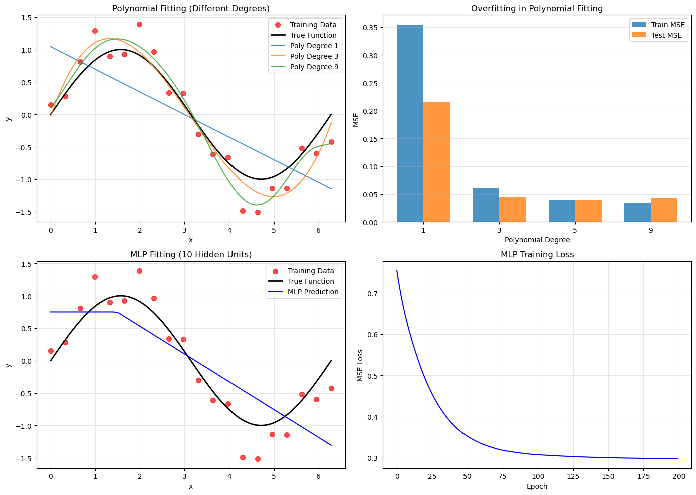

# 第5章：LLM基础

\*\*版本：\*\* v2.1  
**最后更新：** 2026-05-14

## 章节概览

本章介绍LLM的核心概念和原理，包括预训练、Scaling Laws、In-Context Learning和Prompt工程。这些概念是理解和使用LLM的基础。

## 小节目录

- **5.1 预训练思想** — 为什么预训练这么重要
- **5.2 Scaling Laws** — 模型大小、数据量、计算量的关系
- **5.3 In-Context Learning** — LLM的关键能力
- **5.4 Prompt工程基础** — 如何写好Prompt

## 学习时间

- **快速版**（仅阅读正文）：20分钟
- **深度版**（包含代码实验）：50分钟

## 核心问题

完成本章后，你应该能回答：

1. 预训练如何解决数据标注的问题？
2. Scaling Laws告诉我们什么？
3. In-Context Learning是什么？
4. 如何写好Prompt？

## 代码实验

本章包含代码实验，帮助理解LLM的基本概念：

### 实验：多项式拟合 vs MLP（表达能力对比）
- **文件：** [`code/ch03_deep_learning_fast/polynomial_vs_mlp.py`](../../code/ch03_deep_learning_fast/polynomial_vs_mlp.py)
- **内容：** 展示神经网络相比传统方法的表达能力优势，这是预训练有效的基础
- **运行：** `python code/ch03_deep_learning_fast/polynomial_vs_mlp.py`
- **输出：** 拟合曲线对比、误差分析、表达能力对比

*图5.1：多项式拟合与MLP的对比。展示神经网络的表达能力为什么能通过大规模预训练得到充分发挥。*

### 实验：LLM API调用与Prompt工程
- **文件：** [`code/ch05_llm_basics/llm_api_demo.py`](../../code/ch05_llm_basics/llm_api_demo.py)
- **内容：** 调用LLM API，观察In-Context Learning现象，实验不同Prompt的效果
- **运行：** `python code/ch05_llm_basics/llm_api_demo.py`
- **输出：** API调用结果、Prompt效果对比、In-Context Learning演示

## 推荐学习路径

1. **快速入门（20分钟）**
   - 阅读 5.1-5.4 的正文
   - 查看图表和公式
   - 理解核心概念

2. **深度学习（50分钟）**
   - 阅读所有内容
   - 运行代码实验
   - 分析实验结果
   - 回答"核心问题"中的4个问题

## 关键概念速查

| 概念 | 说明 | 重要性 |
|------|------|--------|
| 预训练 | 在大规模无标注数据上训练 | 🔴 核心 |
| Scaling Laws | 性能与模型大小/数据量的关系 | 🔴 核心 |
| In-Context Learning | 从示例中学习，无需微调 | 🔴 核心 |
| Prompt工程 | 通过精心设计输入来引导模型 | 🟡 重要 |

## 常见问题

**Q: 为什么预训练这么重要？**
A: 预训练让模型在大规模无标注数据上学习通用知识，这比在小规模标注数据上训练效果好得多。

**Q: Scaling Laws意味着什么？**
A: 更大的模型和更多的数据通常能带来更好的性能，但收益会逐渐递减。

**Q: In-Context Learning是如何工作的？**
A: 模型通过Transformer的自注意力机制，在推理时从输入的示例中学习模式，而无需更新参数。

**Q: 好的Prompt有什么特点？**
A: 清晰、具体、包含相关背景信息、给出示例（Few-shot）。

## 扩展内容

- 模型架构变种
- 训练技巧

---

**下一步：** 阅读 [5.1 预训练思想](01_pretraining.md)
