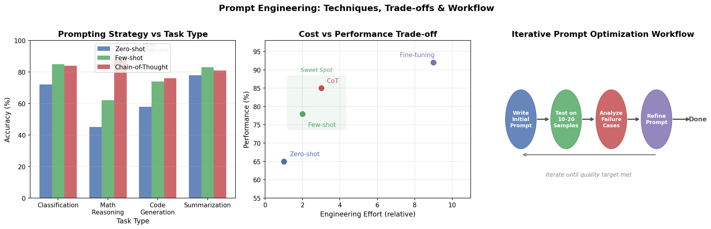

# 6.1 Prompt 工程

**核心问题：** 如何通过设计 Prompt 充分发挥 LLM 的能力？

---

## Prompt 工程的定位

Prompt 工程是使用 LLM 的第一步，也是成本最低的优化手段：

```
优化路径（按成本递增）：
  Prompt 工程 → RAG → 微调 → 预训练

先用 Prompt 工程验证任务可行性，
再根据需要升级到 RAG 或微调。
```

---

## 基本原则

### 清晰具体

```
❌ 模糊：总结这篇文章
✅ 具体：用 3 句话总结以下文章的核心观点，
         面向没有技术背景的读者
```

### 提供上下文

```
❌ 无上下文：翻译这段话
✅ 有上下文：你是一名医学翻译，请将以下临床报告
             从英文翻译成中文，保留专业术语的准确性
```

### 指定输出格式

```
请分析以下代码的问题，输出格式：
1. 问题描述（一句话）
2. 根本原因
3. 修复建议（代码示例）
```

---

## 核心技巧

### Zero-shot vs Few-shot

```
Zero-shot（无示例）：
  将以下句子分类为正面/负面情感：
  "这部电影太棒了！"

Few-shot（有示例）：
  示例1：这部电影太棒了！→ 正面
  示例2：服务态度很差。→ 负面
  示例3：还行吧，一般般。→ 中性
  请分类：这家餐厅的食物让我失望。
```

**何时用 Few-shot：** 任务格式复杂、输出有特定结构要求、Zero-shot 效果不稳定时。

### Chain-of-Thought（思维链）

让模型"一步步思考"，显著提升推理准确率：

```
❌ 直接回答：
  问：Roger 有 5 个网球，买了 2 罐（每罐 3 个），共几个？
  答：11

✅ Chain-of-Thought：
  问：Roger 有 5 个网球，买了 2 罐（每罐 3 个），共几个？
  让我一步步思考：
  - Roger 原有 5 个
  - 买了 2 罐 × 3 个/罐 = 6 个
  - 共 5 + 6 = 11 个
  答：11
```

**触发方式：**
- 显式：在 prompt 中加"让我一步步思考"
- Few-shot CoT：提供带推理过程的示例
- 自动：现代模型（o1/R1）会自动进行内部推理

### 角色设定（System Prompt）

```
你是一名资深的 Python 工程师，有 10 年后端开发经验。
你的回答应该：
- 优先考虑代码的可维护性和性能
- 指出潜在的安全风险
- 提供具体的代码示例
```

**效果：** 角色设定能稳定输出风格，减少不必要的免责声明，提升专业度。

### 结构化输出

要求模型输出 JSON 或特定格式，便于程序处理：

```
请分析以下代码，以 JSON 格式输出：
{
  "issues": [{"type": "...", "line": ..., "description": "..."}],
  "severity": "high/medium/low",
  "fix_suggestion": "..."
}
```

**注意：** 复杂 JSON 结构可能出错，建议使用支持 structured output 的 API（OpenAI、Anthropic 均支持）。

---

## 高级技巧

### Self-Consistency（自洽性）

生成多个推理路径，投票选择最一致的答案：

```
对同一问题生成 5 个回答
→ 答案A出现3次，答案B出现2次
→ 选择答案A
```

**适用场景：** 数学推理、逻辑判断等有明确答案的任务。

### Tree of Thought（思维树）

探索多个推理分支，选择最优路径：

```
问题
├─ 思路A → 中间结果A1 → 最终答案A
├─ 思路B → 中间结果B1 → 死路（回溯）
│              └─ 中间结果B2 → 最终答案B
└─ 思路C → ...
```

**适用场景：** 需要探索多种可能性的复杂问题（规划、创意写作）。

### 迭代优化

Prompt 工程是迭代过程：

```
1. 写初始 Prompt
2. 测试 10-20 个样本
3. 分析失败案例
4. 针对性修改 Prompt
5. 重复直到满足要求
```

---

## 常见陷阱

| 陷阱 | 问题 | 解决方法 |
|------|------|---------|
| 过度限制 | 太多约束导致模型无法发挥 | 只指定必要约束 |
| 歧义指令 | 模型理解与预期不同 | 提供示例澄清 |
| 上下文过长 | 关键信息被稀释 | 把重要信息放在开头或结尾 |
| 否定指令 | "不要做X"效果差 | 改为"请做Y" |
| 忽略温度参数 | 创意任务用低温，推理任务用高温 | 根据任务调整 temperature |

---

## 与其他方法的配合

```
Prompt 工程 + RAG：
  Prompt 设计检索策略和回答格式
  RAG 提供最新知识

Prompt 工程 + 微调：
  微调固定输出格式和领域风格
  Prompt 工程处理具体任务变体

System Prompt + User Prompt：
  System：设定角色、约束、输出格式
  User：具体任务内容
```

---

## In-Context Learning vs 微调

Prompt 工程（包括 Few-shot）本质上是 In-Context Learning（ICL）——不更新参数，仅通过 prompt 中的示例让模型完成新任务。和微调的对比：

| 维度 | ICL / Prompt 工程 | 微调 |
|------|------------------|------|
| 参数更新 | 否 | 是 |
| 数据需求 | 几条示例 | 数百到数千条 |
| 推理成本 | 高（示例占用 context） | 低（示例已编码进参数） |
| 灵活性 | 高（随时换任务） | 低（需要重新训练） |
| 效果上限 | 低于微调 | 高于 ICL |

**实践建议：** 先用 ICL 快速验证任务可行性；示例选择与输入相似、覆盖边界情况、格式一致；ICL 效果不够再考虑微调。

ICL 的原理（为什么 LLM 能从示例中学习）见 [第5章 5.1 预训练](../05_llm_basics/01_pretraining.md)。

---

## 本节小结

- Prompt 工程是成本最低的 LLM 优化手段，应该先于 RAG 和微调尝试
- **Chain-of-Thought** 对推理任务效果显著，现代模型已内置
- **Few-shot** 示例能稳定输出格式，但示例质量比数量更重要
- Prompt 工程是迭代过程，需要系统测试和分析失败案例

---

**下一节：** [6.2 微调：让 LLM 适配你的任务](02_finetuning.md)

---

## 进阶阅读

本节聚焦手工 Prompt 工程的核心技巧。如需更深入的内容：

- **自动化 Prompt 优化**：DSPy 框架（程序化 Prompt，将 Prompt 编写转为优化问题）、APE（Automatic Prompt Engineer，用 LLM 自动生成和筛选 Prompt）
- **Prompt 评估**：PromptBench（鲁棒性评估）、HELM（斯坦福综合评估套件）
- **模型特定格式**：Llama/Qwen/Mistral 等模型的 chat template 差异（`<|im_start|>` vs `[INST]` 等）

> 提示：以上内容属于研究前沿，多数生产场景中，本节的手工优化方法已经足够。

---

## 代码实验



*图6.1：Prompt 工程三种策略对比与迭代优化工作流。左图：Zero-shot / Few-shot / CoT 在不同任务类型上的准确率对比；中图：四种方法的成本-效果权衡；右图：迭代优化循环流程。*

**代码文件：** [`code/ch06_llm_applications/prompt_demo.py`](../../code/ch06_llm_applications/prompt_demo.py)  
**运行方式：** `python code/ch06_llm_applications/prompt_demo.py`
