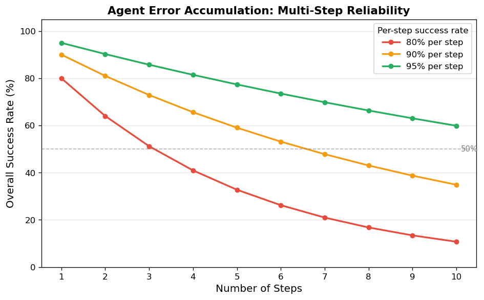

# 6.4 Agent 框架

**核心问题：** 如何让 LLM 能调用工具和规划？

---

## 问题：LLM 只能生成文本

LLM 本身是一个文本输入 → 文本输出的系统。它能推理、能写代码、能分析问题，但有一个根本限制：**它无法执行任何操作**。

- 问"今天天气怎么样"——它只能根据训练数据猜测，无法查询实时天气
- 问"帮我计算这个积分"——它可能算错，因为它是在"预测文字"而不是"真正计算"
- 问"帮我发一封邮件"——它能写邮件内容，但无法真正发送

**Agent 的思路：** 给 LLM 配备工具，让它决定什么时候调用哪个工具，把"文字推理"和"实际执行"结合起来。

---

## ReAct：为什么先 Reason 再 Act

Agent 的核心模式叫 **ReAct**（Reason + Act），每一步分三个阶段：

```
[Reason]  LLM 分析当前情况，决定下一步做什么
    ↓
[Act]     调用工具，执行操作
    ↓
[Observe] 观察工具返回的结果
    ↓
回到 [Reason]，根据新信息继续推理
    ↓
重复，直到得出最终答案
```

**为什么不直接 Act？** 因为复杂任务需要多步规划，每一步的行动取决于上一步的结果。先推理再行动，能让 LLM 根据实时反馈调整策略，而不是一开始就把所有步骤固定死。

**一个具体例子：**

```
问题："70B 模型用 LoRA 微调需要多少参数？"

Step 1:
  Reason  → "需要知道 LoRA 的参数比例，先搜索"
  Act     → search("LoRA 参数比例")
  Observe → "LoRA 只训练约 1% 的参数"

Step 2:
  Reason  → "已知比例，现在计算：70B × 1%"
  Act     → calculate("70_000_000_000 * 0.01")
  Observe → "700,000,000"

Step 3:
  Reason  → "计算完成，可以回答了"
  Answer  → "约 7 亿参数，是全量微调的 1%"
```

---

## 工具定义：描述质量决定调用准确率

工具的 `description` 字段是 LLM 决策的依据。描述越精确，LLM 越能选对工具：

```python
# ❌ 描述模糊，LLM 可能误用
{"name": "search", "description": "搜索信息"}

# ✅ 描述精确，包含适用场景和不适用场景
{
    "name": "search",
    "description": "在知识库中搜索概念定义和技术原理。"
                   "适用于：查找定义、了解背景知识。"
                   "不适用于：实时数据、数值计算。"
}
```

**三要素：** 做什么 + 什么时候用 + 什么时候不用。缺少后两条，LLM 容易在不该调用时调用，或在该调用时选错工具。

---

## 为什么 Agent 容易出错

Agent 的可靠性问题来自**错误累积**。假设每一步工具调用的成功率是 90%：

| 任务步数 | 整体成功率 |
|---------|-----------|
| 1 步 | 90% |
| 3 步 | 73% |
| 5 步 | 59% |
| 10 步 | 35% |

**计算方式：** 整体成功率 = 单步成功率 ^ 步数。步骤越多，成功率指数级下降。

这意味着：
- **简单任务（1-2步）**：Agent 很可靠
- **复杂任务（5步以上）**：Agent 容易失败，需要加入错误处理和重试机制
- **工程实践**：控制 Agent 步数，复杂任务拆分为多个简单 Agent 串联

---

## Agent 的适用边界

**适合 Agent 的场景：**
- 需要访问实时数据（搜索、查数据库）
- 需要执行计算或代码
- 多步骤任务，且每步依赖上一步结果
- 需要调用外部 API（发邮件、创建日历事件）

**不适合 Agent 的场景：**
- 任务可以一次性完成（直接用 Prompt 更简单）
- 对可靠性要求极高（Agent 的不确定性难以消除）
- 工具调用有副作用且不可撤销（删除文件、发送消息）

**实践建议：** 先用 Prompt 工程验证任务可行性，只有在 LLM 单次生成无法完成时才引入 Agent。

---

## 代码实验



*图6.4：多步 Agent 任务的整体成功率随步数指数级下降。单步成功率 90% 时，10 步任务的整体成功率仅 35%。*

**代码文件：** [`code/ch06_llm_applications/agent_demo.py`](../../code/ch06_llm_applications/agent_demo.py)  
**运行方式：** `python code/ch06_llm_applications/agent_demo.py`

---

## 本节小结

- Agent 让 LLM 通过工具调用突破"只能生成文本"的限制
- **ReAct 模式**：先推理（Reason）再行动（Act），根据观察结果（Observe）循环迭代
- 工具描述质量直接决定调用准确率，需要明确适用和不适用场景
- Agent 的核心风险是**错误累积**：步骤越多，整体可靠性越低
- 适合多步骤、依赖实时数据的任务；不适合对可靠性要求极高或有不可撤销副作用的场景

---

---

**下一节：** [6.5 LLM 系统设计](05_system_design.md)
**扩展阅读：** [Agent 框架深度](extensions/agent_advanced.md)（工具可靠性、多步推理控制、主流框架选型）
