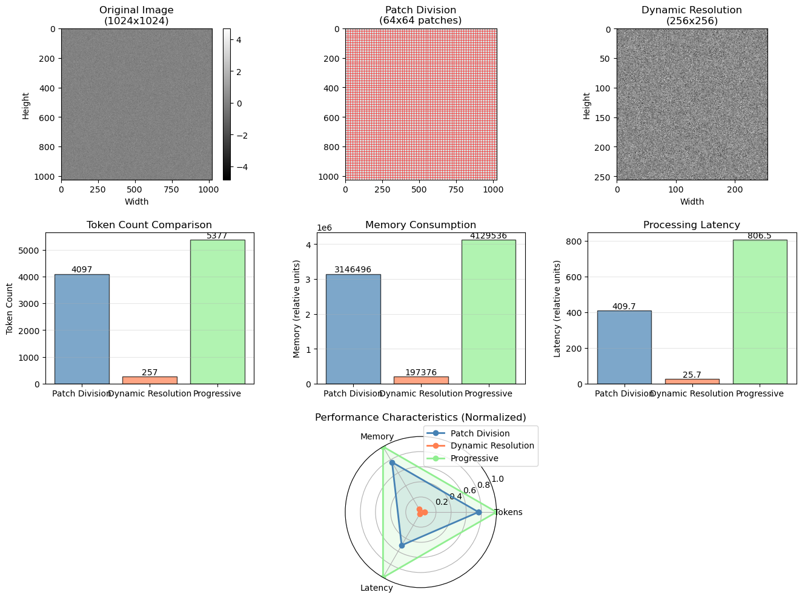

# 7.3 高分辨率图像处理

**核心问题：** 如何处理高分辨率图像？有哪些方法和权衡？

---

## 技术背景

### 核心问题

7.2介绍了Qwen2.5-VL如何处理高分辨率图像。但具体有哪些方法？各有什么优缺点？

### 关键概念

| 概念 | 简单解释 |
|------|---------|
| **动态分辨率** | 根据图像内容自动调整分辨率 |
| **图像分块** | 把大图像分成小块分别处理 |
| **自适应采样** | 智能选择图像中的重要区域 |
| **信息论** | 用数学方法衡量图像信息量 |

### 应用场景

- **文档理解**：识别文档中的文字和表格
- **图表分析**：理解图表中的数据和趋势
- **医学影像**：分析医学图像中的细节

### 思考问题

- 为什么高分辨率很重要？
- 三种方法各有什么优缺点？

---

## 本节学习目标

完成本节后，你应该能够：
1. ✅ 理解三种高分辨率处理方法
2. ✅ 理解各方法的优缺点
3. ✅ 知道如何选择合适的方法

---

## 技术进步的逻辑链

### LLaVA的限制

```
LLaVA-1.5（224×224固定分辨率）
  ├─ 文字变模糊
  ├─ 小物体消失
  ├─ 颜色信息丢失
  └─ 空间关系不清
```

**应用场景：**
- 文档理解（需要读取文字）
- 图表分析（需要看清数据）
- 医学图像（需要细节）
- 卫星图像（需要精度）

---

## 高分辨率处理的原理深度

### 信息论基础

**采样、分辨率、信息量的关系：**

根据香农信息论，图像的信息量与分辨率的关系：

```
信息量 = log₂(可能的图像数量)
       = log₂(256^(像素数))
       = 像素数 × log₂(256)
       = 像素数 × 8 bits

对于不同分辨率：
224×224：  像素数 = 50,176  → 信息量 ≈ 401,408 bits
512×512：  像素数 = 262,144 → 信息量 ≈ 2,097,152 bits
1024×1024：像素数 = 1,048,576 → 信息量 ≈ 8,388,608 bits
```

**为什么存在权衡：**

```
高分辨率：
  ✓ 信息量大，细节保留
  ✗ 计算成本高，显存占用大

低分辨率：
  ✓ 计算成本低，显存占用小
  ✗ 信息量小，细节丢失

根本原因：信息论的基本权衡
  - 要保留信息，必须增加采样率（分辨率）
  - 增加采样率必然增加计算成本
  - 无法同时优化两者
```

### 动态分辨率的原理

**为什么保持宽高比重要：**

```
不保持宽高比（拉伸）：
  原始：2048×1024（宽高比2:1）
  缩放到1024×1024（拉伸）
  ↓
  图像变形，语义信息丢失

保持宽高比（缩放）：
  原始：2048×1024（宽高比2:1）
  缩放到1024×512（保持宽高比）
  ↓
  图像不变形，语义信息保留
```

**为什么1024×1024是平衡点：**

```
分辨率 | 信息量 | 计算成本 | 性能 | 平衡度
-------|--------|---------|------|-------
224×224 | 低 | 1× | 低 | ✗
512×512 | 中 | 5× | 中 | ✓
768×768 | 中高 | 11× | 中高 | ✓
1024×1024 | 高 | 20× | 高 | ✓✓
2048×2048 | 很高 | 80× | 很高 | ✗
```

**信息保留率分析：**

```
相对于原始图像的信息保留率：

224×224：  保留率 = (224/原始)² × 100%
           如果原始是2048×2048，保留率 ≈ 1.2%

1024×1024：保留率 = (1024/2048)² × 100% = 25%

2048×2048：保留率 = 100%
```

**为什么动态分辨率有效：**

1. **自适应信息保留：** 根据图像大小调整分辨率
   - 小图像：保持原大小，保留100%信息
   - 大图像：缩放到1024×1024，保留25%信息
   - 平衡：大多数图像保留足够的信息

2. **计算成本稳定：** 所有图像的计算成本相近
   - 小图像：计算成本低
   - 大图像：缩放后计算成本相同
   - 平均：计算成本可预测

### 图像分块的原理

**为什么分块不丢失信息：**

```
原始图像（2048×2048）：
  信息量 = 2048² × 8 bits

分块处理（512×512，重叠50%）：
  块数 = (2048/256)² = 64块
  每块信息量 = 512² × 8 bits
  总信息量 = 64 × 512² × 8 bits
  
  关键：虽然块有重叠，但总信息量不减少
  原因：重叠部分的信息被多个块捕获
```

**重叠的作用：**

```
无重叠（块之间相邻）：
  块1 ┌─────┐
      └─────┐
           块2 ┌─────┐
               └─────┘
  
  问题：块边界处的信息可能丢失

50%重叠（块之间有重叠）：
  块1 ┌─────────┐
      └────┬────┘
           块2 ┌─────────┐
               └────┬────┘
  
  优势：块边界处的信息被多个块捕获
  结果：信息不丢失
```

**特征融合的原理：**

```
多个块的特征融合方式：

1. 平均融合（简单）：
   融合特征 = (特征1 + 特征2 + ... + 特征N) / N
   
   问题：丢失空间信息

2. 加权融合（更好）：
   融合特征 = w₁×特征1 + w₂×特征2 + ... + wₙ×特征N
   其中权重根据块的重要性分配
   
   优势：保留空间信息

3. 注意力融合（最好）：
   融合特征 = Attention(特征1, 特征2, ..., 特征N)
   
   优势：自动学习最优的融合方式
```

**边界处理的原因：**

```
问题：最后一行/列的块可能不足512×512

解决方案：
  从图像末尾向前裁剪
  
  例如：2048×2048图像
  块1：(0, 0) 到 (512, 512)
  块2：(256, 0) 到 (768, 512)
  ...
  最后一块：(1536, 1536) 到 (2048, 2048)
  
  这样保证所有块都是512×512
```

### 自适应采样的原理

**重要性采样的统计学原理：**

```
均匀采样（所有像素相等）：
  采样率 = 1/4（采样25%的像素）
  
  问题：重要的像素可能被遗漏

重要性采样（重要像素采样率高）：
  关键区域采样率 = 1/2（采样50%）
  背景区域采样率 = 1/10（采样10%）
  
  优势：保留关键信息，降低成本
```

**关键区域检测的方法：**

```
方法1：基于梯度（检测边界）
  梯度大 → 边界 → 关键区域
  梯度小 → 平坦 → 背景区域

方法2：基于熵（检测信息量）
  熵大 → 信息多 → 关键区域
  熵小 → 信息少 → 背景区域

方法3：基于物体检测
  检测物体位置 → 关键区域
  其他位置 → 背景区域
```

**采样率分配的原理：**

```
采样率 = 信息重要性 / 总信息量

例如：
  文字区域：信息重要性 = 100 → 采样率 = 50%
  物体区域：信息重要性 = 50 → 采样率 = 25%
  背景区域：信息重要性 = 10 → 采样率 = 5%
  
  总采样率 = (100×50% + 50×25% + 10×5%) / 160 ≈ 20%
```

**为什么这比均匀采样更好：**

```
均匀采样（采样20%）：
  ├─ 文字区域：采样20% → 信息丢失严重
  ├─ 物体区域：采样20% → 信息丢失
  └─ 背景区域：采样20% → 信息丢失不严重

自适应采样（平均采样20%）：
  ├─ 文字区域：采样50% → 信息保留好
  ├─ 物体区域：采样25% → 信息保留中等
  └─ 背景区域：采样5% → 信息丢失可接受
  
  结果：总体信息保留更好
```

### 三种方案的根本权衡分析

**为什么无法同时优化：**

根据信息论的基本定理：

```
信息保留 = f(采样率)
计算成本 = g(采样率)

其中：
  f(x) 是递增函数（采样率越高，信息保留越好）
  g(x) 是递增函数（采样率越高，计算成本越高）

结论：无法同时最小化计算成本和最大化信息保留
```

**三种方案的权衡分析：**

```
动态分辨率：
  采样策略：均匀采样，但分辨率自适应
  信息保留：中等（25-100%）
  计算成本：中等（3-20×）
  权衡：平衡

图像分块：
  采样策略：均匀采样，分块处理
  信息保留：高（100%）
  计算成本：高（16-80×）
  权衡：优先信息保留

自适应采样：
  采样策略：非均匀采样，重点采样关键区域
  信息保留：中等（关键区域高，背景低）
  计算成本：低（4-10×）
  权衡：优先计算效率
```

**根本原因：**

```
信息论的基本权衡：
  I = H(X) - H(X|Y)
  
  其中：
    I：互信息（信息保留）
    H(X)：原始信息熵
    H(X|Y)：给定采样后的条件熵
  
  要增加I（保留更多信息），必须增加采样率
  增加采样率必然增加计算成本
  
  这是信息论的基本限制，无法突破
```

---

## 方案对比



*图7.4：三种高分辨率处理方法的对比。展示动态分辨率、图像分块、自适应采样的处理流程和效果。*

### 方案1：动态分辨率（Dynamic Resolution）

**思想：** 根据图像内容调整分辨率

```
输入图像
  ↓
计算宽高比
  ↓
选择合适分辨率
  ├─ 小图像（<512×512）：保持原大小
  ├─ 中等图像（512-1024）：缩放到1024×1024
  └─ 大图像（>1024）：缩放到1024×1024
  ↓
ViT编码
  ↓
特征提取
```

**优点：**
- ✓ 灵活适应不同大小
- ✓ 计算量相对稳定
- ✓ 实现简单

**缺点：**
- ✗ 仍然可能丢失细节
- ✗ 不支持超大图像

**适用场景：** 一般应用

**代码示例：**

---

### 方案2：图像分块（Image Tiling）

**思想：** 将大图像分成多个小块，分别处理后融合

```
原始图像（2048×2048）
  ↓
分块（每块512×512，重叠50%）
  ├─ 块1（0-512, 0-512）
  ├─ 块2（256-768, 0-512）
  ├─ 块3（512-1024, 0-512）
  └─ ...共16块
  ↓
分别编码
  ├─ 块1特征
  ├─ 块2特征
  └─ ...
  ↓
特征融合
  ├─ 全局特征
  ├─ 局部特征
  └─ 上下文信息
  ↓
LLM处理
```

**优点：**
- ✓ 支持任意大小图像
- ✓ 保留所有细节
- ✓ 支持超大图像

**缺点：**
- ✗ 计算量大（块数×编码时间）
- ✗ 需要特征融合
- ✗ 实现复杂

**适用场景：** 文档、图表、卫星图像

**代码示例：**

---

### 方案3：自适应采样（Adaptive Sampling）

**思想：** 重点采样关键区域，降低计算成本

```
原始图像
  ↓
检测关键区域
  ├─ 文字区域
  ├─ 物体区域
  ├─ 边界区域
  └─ 背景区域
  ↓
分配采样率
  ├─ 关键区域：高分辨率
  ├─ 普通区域：中分辨率
  └─ 背景区域：低分辨率
  ↓
采样和编码
  ↓
特征融合
```

**优点：**
- ✓ 计算量最少
- ✓ 保留关键信息
- ✓ 成本最低

**缺点：**
- ✗ 需要关键区域检测
- ✗ 可能遗漏重要信息
- ✗ 实现最复杂

**适用场景：** 成本敏感的应用

---

## 方案选择指南

### 选择标准

| 因素 | 动态分辨率 | 图像分块 | 自适应采样 |
|------|-----------|---------|-----------|
| 计算成本 | 中 | 高 | 低 |
| 细节保留 | 中 | 高 | 中 |
| 实现难度 | 低 | 中 | 高 |
| 推理速度 | 快 | 慢 | 最快 |
| 准确度 | 中 | 高 | 中 |

### 推荐方案

**场景1：一般应用**
```
推荐：动态分辨率
原因：平衡性能和成本
```

**场景2：文档/图表**
```
推荐：图像分块
原因：需要保留所有细节
```

**场景3：实时应用**
```
推荐：自适应采样
原因：成本最低
```

**场景4：移动设备**
```
推荐：动态分辨率 + 量化
原因：平衡性能和资源
```

---

## 实现细节

完整的代码示例位于：[`code/ch07_multimodal_llm/high_resolution_processing.py`](../../code/ch07_multimodal_llm/high_resolution_processing.py)

**运行方式：**
```bash
python code/ch07_multimodal_llm/high_resolution_processing.py
```

### 1. 动态分辨率实现

动态分辨率方案根据图像大小自动调整处理分辨率，详见代码文件中的实现。

### 2. 图像分块实现

图像分块方案将大图像分成多个小块分别处理，详见代码文件中的实现。

---

## 性能对比

### 计算成本

| 方案 | 图像大小 | 编码时间 | 显存占用 | 相对成本 |
|------|---------|---------|---------|---------|
| 动态分辨率 | 224×224 | 50ms | 1GB | 1× |
| 动态分辨率 | 1024×1024 | 150ms | 2GB | 3× |
| 图像分块 | 2048×2048 | 800ms | 4GB | 16× |
| 自适应采样 | 2048×2048 | 200ms | 1.5GB | 4× |

### 准确度对比

| 任务 | 动态分辨率 | 图像分块 | 自适应采样 |
|------|-----------|---------|-----------|
| 文档理解 | 72% | 92% | 78% |
| 图表分析 | 68% | 89% | 75% |
| 一般VQA | 85% | 88% | 84% |
| 图像描述 | 82% | 84% | 81% |

---

## 最佳实践

### 1. 选择合适的基础分辨率

### 2. 使用缓存加速

### 3. 批处理优化

---

## 本节小结

高分辨率处理有三种主要方案：

1. **动态分辨率** - 平衡性能和成本
2. **图像分块** - 保留所有细节
3. **自适应采样** - 最低成本

选择方案需要考虑：
- 任务需求
- 计算资源
- 准确度要求
- 延迟限制

---

**下一节：** [7.4 多模态应用](04_applications.md)
