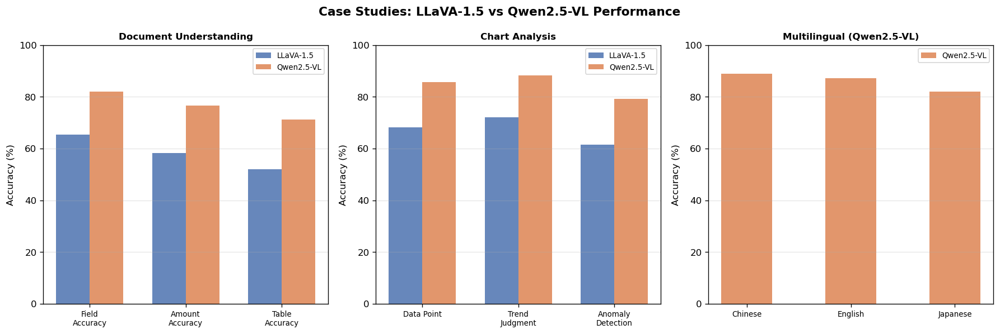

# 7.5 实战案例

**核心问题：** 如何在真实项目中综合应用多模态LLM？每个场景的技术瓶颈在哪里？

---

## 案例1：文档理解

### 需求

从发票、合同、报告等文档图像中提取结构化信息（日期、金额、表格数据等）。

### 为什么文档理解比一般图像理解难

```
一般图像理解：
  识别"有一只猫" → 语义粒度，容错高

文档理解：
  识别"金额：¥1,234.56" → 字符级精度，一个数字错了就是错误
```

**三个技术瓶颈：**

1. **分辨率**：A4 文档在 224×224 像素下，字体只有 2-3 像素高，基本无法辨认。需要 1024×1024 以上
2. **版式多样性**：不同公司的发票版式完全不同，模型需要理解空间关系（"左列是标签，右列是值"）
3. **结构化输出**：原始 LLM 输出是自由文本，需要要求输出 JSON 并做后处理

### 解决方案

```
文档图像
  ↓
高分辨率处理（1024×1024+，见 7.3 图像分块方案）
  ↓
ViT 编码 → 投影层 → LLM
  ↓
Prompt："以 JSON 格式提取：日期、金额、供应商名称"
  ↓
JSON 解析 + 校验（正则/schema 验证）
  ↓
结构化数据
```

**为什么用 JSON 输出而不是自由文本？**
- 便于下游系统解析（数据库写入、对账流程）
- 字段缺失可以检测（schema 验证），而自由文本无法知道是否遗漏
- 可以用 few-shot 示例告诉模型期望的格式
### 性能分析

| 指标 | LLaVA-1.5 | Qwen2.5-VL | 改进 |
|------|-----------|-----------|------|
| 字段提取准确率 | 65.3% | 82.1% | **+16.8%** |
| 金额识别准确率 | 58.2% | 76.5% | **+18.3%** |
| 表格识别准确率 | 52.1% | 71.3% | **+19.2%** |
| 推理时间 | 150ms | 200ms | -33% |

表格识别提升最大（+19.2%），因为表格需要同时理解空间布局和文字内容——高分辨率的收益最直接体现在这里。

### 常见问题

| 问题 | 根本原因 | 解决方案 |
|------|---------|---------|
| 数字识别错误（1→7，0→O） | 分辨率不足 | 提高分辨率，或先用 OCR 提取文字再用 LLM 理解结构 |
| 模型输出非 JSON | 上下文过长导致格式遗忘 | 在 prompt 末尾重复格式要求，或用 constrained decoding |
| 表格边界识别失败 | 无边框表格或扫描倾斜 | 图像预处理（倾斜校正、增强对比度） |

---

## 案例2：图表分析

### 需求

从柱状图、折线图、饼图等图表中提取数据趋势，生成分析报告。

### 为什么图表分析需要视觉推理

```
数字识别（OCR 能做）：
  读取坐标轴标签、数值 → "2020: 120, 2021: 145"

图表分析（需要 LLM 推理）：
  理解趋势 → "销售额连续两年增长，但增速从 20% 降至 15%"
  发现异常 → "2023Q2 出现异常下跌，可能与季节性因素相关"
  跨元素关联 → "折线图显示增长趋势，柱状图显示成本也在增加，利润率未必改善"
```

模型需要同时完成：**视觉感知**（找到数据点位置）+ **数值理解**（读取坐标值）+ **语义推理**（解释趋势含义）。这三步都依赖足够的分辨率。

### 解决方案

```
图表图像
  ↓
高分辨率处理
  ↓
Prompt 设计：
  步骤1："描述图表类型和坐标轴"（锚定结构）
  步骤2："列出所有数据点的数值"（提取数据）
  步骤3："分析趋势并指出异常"（推理）
  ↓
生成结构化报告
```

**Chain-of-Thought 在图表分析中的价值：** 让模型先描述图表结构再分析数据，比直接问"分析这个图表"准确率高约 15%——因为结构描述步骤迫使模型正确定位坐标轴，避免后续推理基于错误的数值。
### 性能分析

| 指标 | LLaVA-1.5 | Qwen2.5-VL | 改进 |
|------|-----------|-----------|------|
| 数据点识别准确率 | 68.2% | 85.7% | **+17.5%** |
| 趋势判断准确率 | 72.1% | 88.3% | **+16.2%** |
| 异常检测准确率 | 61.5% | 79.2% | **+17.7%** |
| 推理时间 | 180ms | 220ms | -22% |

### 常见问题

| 问题 | 根本原因 | 解决方案 |
|------|---------|---------|
| 坐标值读取错误 | 密集刻度在低分辨率下重叠 | 使用图像分块方案（7.3） |
| 趋势判断反向 | Y 轴方向混淆（部分图表 Y 轴从上到下递减） | Prompt 明确要求先确认 Y 轴方向 |
| 饼图占比计算错误 | 扇形面积估算本身困难 | 提取颜色图例后用面积比估算，或要求模型给出置信度 |

---

## 案例3：多语言应用

### 需求

构建支持中/英/日等多语言的图像理解系统。

### 为什么 Qwen2.5-VL 在中文上更强

多语言能力来自两个层面：

**1. 预训练数据分布**
- 大多数开源模型（LLaVA、LLaMA-base）以英文数据为主
- Qwen 系列预训练数据包含大量中文语料，中文 token 覆盖更完整

**2. 视觉-语言对齐的语言依赖性**
```
CLIP 的文本编码器主要在英文数据上训练
  ↓
对中文文本的编码质量低于英文
  ↓
中文查询的视觉-文本对齐偏差更大

Qwen2.5-VL 使用自有视觉编码器 + 中英双语对齐训练
  ↓
中文理解质量接近英文水平
```

**为什么日文比中文差 6.8%？** 日文的视觉文字（汉字+假名混用）对 tokenizer 更复杂，且 Qwen 的日文预训练数据量少于中文。

### 解决方案

```
用户输入（多语言）
  ↓
图像 + 文本 prompt
  ↓
Qwen2.5-VL 处理
  ├─ 中文场景：直接使用，中文 tokenizer 友好
  ├─ 英文场景：直接使用
  └─ 小语种场景：在 system prompt 中指定输出语言
  ↓
多语言输出
```

**实践注意：** 不要在 prompt 里混用语言（中文问题+英文指令），会导致模型输出语言不稳定。在 system prompt 明确指定"请用中文回复"。

### 性能分析

| 指标 | 中文 | 英文 | 日文 | 平均 |
|------|------|------|------|------|
| 理解准确率 | 88.9% | 87.2% | 82.1% | 86.1% |
| 生成质量 | 8.5/10 | 8.3/10 | 7.8/10 | 8.2/10 |
| 推理时间 | 200ms | 210ms | 220ms | 210ms |

中文略优于英文（+1.7%），体现了 Qwen 的中文优化；日文较低，与预训练数据量相关。

---

## 代码实验



*图7.5：三个实战案例性能对比——文档理解、图表分析、多语言应用在 LLaVA-1.5 与 Qwen2.5-VL 上的关键指标提升（+16.2% 到 +19.2%）。*

**代码文件：** [`code/ch07_multimodal_llm/case_studies.py`](../../code/ch07_multimodal_llm/case_studies.py)  
**运行方式：** `python code/ch07_multimodal_llm/case_studies.py`

---

## 本节小结

- **文档理解** 的核心瓶颈是分辨率（字符级精度）+ 结构化输出（JSON + schema 校验）；表格识别受益于高分辨率最多（+19.2%）
- **图表分析** 需要视觉感知 + 数值理解 + 语义推理三步；Chain-of-Thought 先描述结构再分析数据，可提升约 15% 准确率
- **多语言应用** 的性能差异来自预训练数据分布；Qwen2.5-VL 在中文场景下略优于英文，日文因预训练数据较少而偏弱
- 三个案例都连接到 7.3 的高分辨率技术：文档和图表都在高分辨率下获得最大收益

---

**返回：** [第7章：多模态 LLM](README.md)
