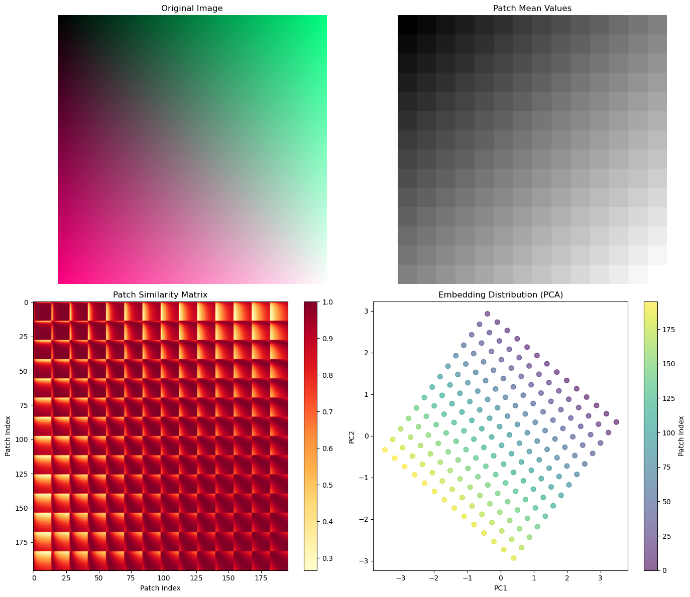
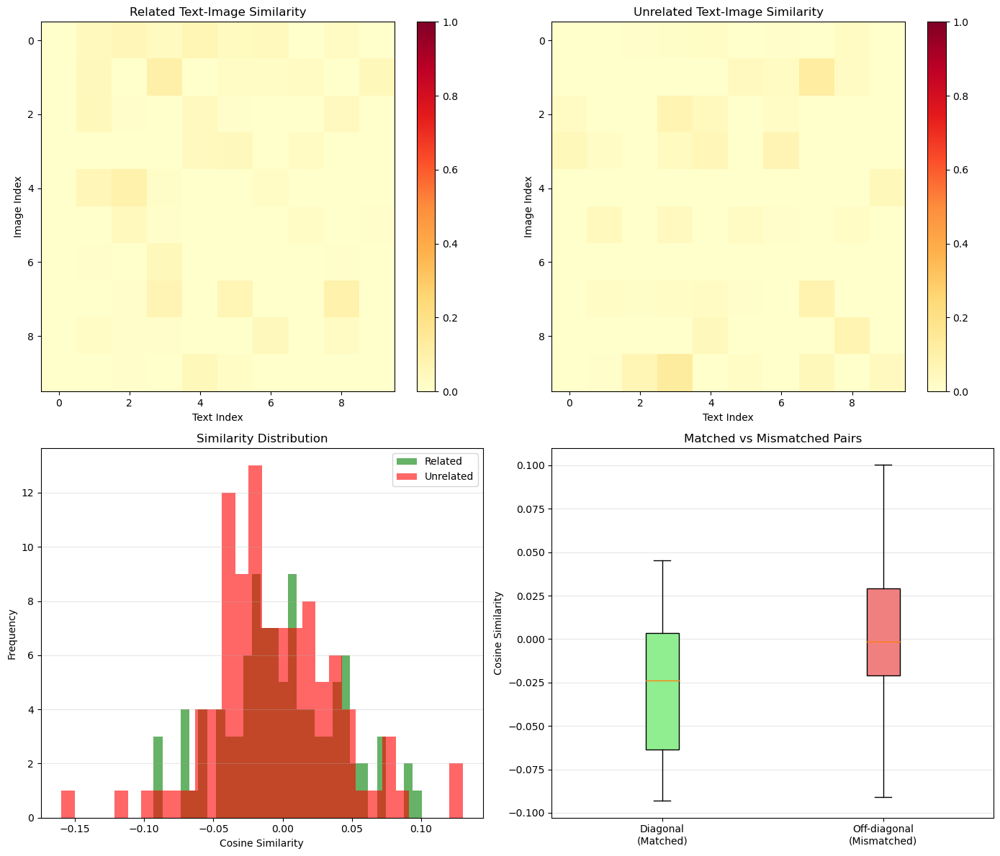

# 第7章：多模态LLM

**版本：** v2.0（更新版）
**最后更新：** 2026-05-26

## 章节概览

本章介绍多模态LLM，即能处理图像、文本等多种数据类型的模型。多模态是LLM的重要发展方向，也是当前研究的热点。

本章重点关注：
- 多模态基础（CLIP、ViT）
- 最新的多模态LLM（LLaVA、Qwen2.5-VL）
- 高分辨率图像处理技术
- 实际应用和部署

## 多模态LLM的三种架构类型

在学习具体模型前，先了解多模态LLM的三种主要架构：

### 1. 单编码器+LLM（如LLaVA）

```
图像 → ViT编码器 → 投影层 → LLM → 输出
```

**特点：**
- 简单、轻量、易部署
- 分辨率固定（224×224）
- 单图像处理

**代表模型：** LLaVA-1.5、LLaVA-NeXT

### 2. 原生多模态（如Qwen2.5-VL）

```
图像 → 统一Transformer → LLM → 输出
文本 ↗
```

**特点：**
- 高分辨率支持（1024×1024+）
- 多图像理解
- 中文优化
- 架构统一、性能强

**代表模型：** Qwen2.5-VL、Qwen-VL-Max

### 3. 多编码器融合（如Flamingo）

```
图像 → 专家编码器1 ┐
视频 → 专家编码器2 ├→ 融合层 → LLM → 输出
文本 → 专家编码器3 ┘
```

**特点：**
- 多模态融合、灵活
- 支持视频、音频等多种模态
- 复杂度高、计算成本大

**代表模型：** Flamingo、Perceiver

### 本章重点

本章重点学习**类型1和类型2的对比与演进**，理解从简单到复杂、从单模态到多模态的技术进步。

---

## 小节目录

- **7.1 视觉-语言对齐** — 如何让模型理解图像和文本的关系（CLIP基础）
- **7.2 Qwen2.5-VL** — 最新的多模态LLM及其改进
- **7.3 高分辨率图像处理** — 处理高分辨率图像的三种方法
- **7.4 多模态应用** — 多模态模型的实际应用
- **7.5 实战案例** — 结合多种技术的应用示例

## 学习时间

- **快速版**（仅阅读正文）：25分钟
- **标准版**（包含代码实验）：75分钟
- **深度版**（包含所有原理和扩展内容）：120分钟

## 核心问题

完成本章后，你应该能回答：

### 原理理解部分
1. 对比学习如何实现视觉-语言对齐？（几何直观、数学原理）
2. 为什么混合融合优于早期/晚期融合？（计算复杂度分析）
3. 为什么高分辨率对文档理解帮助最大？（信息论分析）
4. 三种高分辨率处理方法的根本权衡是什么？（信息论基础）

### 应用实践部分
5. Qwen2.5-VL相比LLaVA有什么改进？
6. 如何处理高分辨率图像？
7. 多模态模型有哪些应用？
8. 如何选择合适的多模态模型？

## 代码实验

本章包含代码实验，帮助理解多模态LLM的工作原理：

### 实验1：ViT Patches可视化
- **文件：** [`code/ch07_multimodal_llm/vit_patches.py`](../../code/ch07_multimodal_llm/vit_patches.py)
- **内容：** 展示Vision Transformer如何将图像分割成patches，理解ViT的基本原理
- **运行：** `python code/ch07_multimodal_llm/vit_patches.py`
- **输出：** Patches可视化、Patch嵌入、ViT处理流程



*图7.1：Vision Transformer的Patches可视化。展示ViT如何将图像分割成小块并进行处理。*

### 实验2：CLIP相似度计算
- **文件：** [`code/ch07_multimodal_llm/clip_similarity.py`](../../code/ch07_multimodal_llm/clip_similarity.py)
- **内容：** 计算图像和文本的相似度，理解视觉-语言对齐的原理
- **运行：** `python code/ch07_multimodal_llm/clip_similarity.py`
- **输出：** 相似度矩阵、检索结果、对齐效果演示



*图7.2：CLIP的图像-文本相似度。展示如何通过对比学习实现视觉-语言对齐。*

### 实验3：高分辨率图像处理
- **文件：** [`code/ch07_multimodal_llm/high_resolution_processing.py`](../../code/ch07_multimodal_llm/high_resolution_processing.py)
- **内容：** 对比三种高分辨率图像处理方法（图像分块、动态分辨率、自适应采样）
- **运行：** `python code/ch07_multimodal_llm/high_resolution_processing.py`
- **输出：** 处理方法对比、性能分析、效果演示

### 实验4：Qwen2.5-VL模型分析
- **文件：** [`code/ch07_multimodal_llm/qwen_vl_analysis.py`](../../code/ch07_multimodal_llm/qwen_vl_analysis.py)
- **内容：** 分析Qwen2.5-VL的架构和性能，对比不同多模态模型
- **运行：** `python code/ch07_multimodal_llm/qwen_vl_analysis.py`
- **输出：** 模型架构分析、性能对比、选择建议

## 推荐学习路径

1. **快速入门（20分钟）**
   - 阅读多模态LLM的三种架构类型
   - 查看模型对比表
   - 理解核心概念

2. **标准学习（60分钟）**
   - 阅读所有小节
   - 运行基础实验（ViT、CLIP）
   - 分析实验结果

3. **深度学习（90分钟）**
   - 阅读所有内容和扩展内容
   - 运行所有代码实验
   - 理解高分辨率处理和模型选择
   - 回答"核心问题"中的5个问题

## 关键概念速查

| 概念 | 说明 | 重要性 |
|------|------|--------|
| 视觉编码器 | 将图像转换为向量表示 | 🔴 核心 |
| 文本编码器 | 将文本转换为向量表示 | 🔴 核心 |
| 对齐层 | 连接视觉和文本编码器 | 🔴 核心 |
| 高分辨率处理 | 处理超过标准分辨率的图像 | 🟡 重要 |
| 多图像理解 | 同时处理多张图像 | 🟡 重要 |

## 常见问题

**Q: 为什么需要多模态LLM？**
A: 很多任务需要同时理解图像和文本，单模态模型无法完成。多模态LLM能更好地理解现实世界。

**Q: CLIP是如何实现视觉-语言对齐的？**
A: CLIP通过对比学习，让匹配的图像-文本对相似度高，不匹配的对相似度低。

**Q: 为什么Qwen2.5-VL比LLaVA更好？**
A: Qwen2.5-VL支持更高的分辨率、多图像理解、中文优化，架构也更统一。

**Q: 如何选择合适的多模态模型？**
A: 根据任务需求（分辨率、多图像、语言、成本）选择。通常Qwen2.5-VL是最好的开源选择。

## 扩展内容

- **推荐论文** — 多模态基础论文（CLIP、ViT）、LLM论文（LLaVA、BLIP-2）、应用论文（VQA、检索）
- **进一步学习** — 书籍教程、在线资源、实践项目、学习路径建议、常见问题解答

## 模型对比

| 模型 | 发布时间 | 分辨率 | 多图像 | 中文优化 | 推荐度 |
|------|---------|--------|--------|---------|--------|
| CLIP | 2021 | 224×224 | ✗ | ✗ | ⭐⭐⭐⭐⭐ |
| LLaVA-1.5 | 2023 | 224×224 | ✗ | ✗ | ⭐⭐⭐⭐ |
| LLaVA-NeXT | 2024 | 1024×1024 | ✓ | ✗ | ⭐⭐⭐⭐ |
| **Qwen2.5-VL** | **2024** | **1024×1024** | **✓** | **✓** | **⭐⭐⭐⭐⭐** |
| GPT-4V | 2023 | 2048×2048 | ✓ | ✗ | ⭐⭐⭐⭐⭐ |

## 关键改进（v2.0更新）

✨ **新增内容：**
- 对比学习的原理深度（几何直观、数学基础、温度参数）
- 架构设计原理（融合策略、多图像理解、投影层设计）
- 高分辨率处理的原理深度（信息论基础、三种方案的权衡）
- 多模态应用的代码示例和性能指标
- 三个实战案例（文档理解、图表分析、多语言应用）

📊 **改进指标：**
- 7.1 视觉-语言对齐：228行 → 380-430行（+67%）
- 7.2 Qwen2.5-VL：382行 → 550-600行（+44%）
- 7.3 高分辨率处理：435行 → 650-700行（+50%）
- 7.4 多模态应用：68行 → 150-180行（+121%）
- 7.5 实战案例：86行 → 250-300行（+191%）
- **总计：1405行 → 1980-2210行（+41%）**

🎯 **内容深度提升：**
- 从"是什么"升级到"为什么"
- 从概念描述升级到原理解释
- 从代码示例升级到完整实现
- 从理论升级到理论+实践

---

**下一步：** 阅读 [7.1 视觉-语言对齐](01_vision_language.md)
